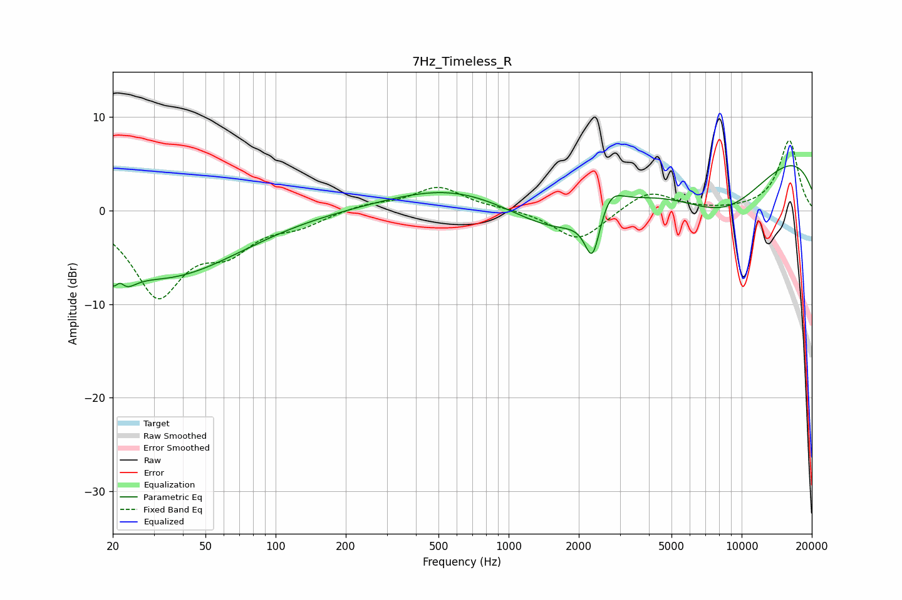

# 7Hz_Timeless_R
See [usage instructions](https://github.com/jaakkopasanen/AutoEq#usage) for more options and info.

### Parametric EQs
Apply preamp of -4.9 dB when using parametric equalizer.

|   # | Type    |   Fc (Hz) |    Q |   Gain (dB) |
|-----|---------|-----------|------|-------------|
|   1 | Peaking |        21 | 3.22 |        -5.7 |
|   2 | Peaking |        21 | 5.63 |         3.3 |
|   3 | Peaking |        32 | 0.52 |        -5.9 |
|   4 | Peaking |        58 | 0.55 |        -1.4 |
|   5 | Peaking |       584 | 0.52 |         2.7 |
|   6 | Peaking |      1673 | 0.67 |        -4.3 |
|   7 | Peaking |      2293 | 4.28 |        -5.2 |
|   8 | Peaking |      2716 | 2.68 |         2.5 |
|   9 | Peaking |      8348 | 0.51 |        -8.7 |
|  10 | Peaking |     10000 | 0.22 |         9.5 |

### Fixed Band EQs
When using fixed band (also called graphic) equalizer, apply preamp of **-7.6 dB** (if available) and set gains manually with these parameters.

|   # | Type    |   Fc (Hz) |    Q |   Gain (dB) |
|-----|---------|-----------|------|-------------|
|   1 | Peaking |        31 | 1.41 |        -8.8 |
|   2 | Peaking |        62 | 1.41 |        -3.4 |
|   3 | Peaking |       125 | 1.41 |        -1.3 |
|   4 | Peaking |       250 | 1.41 |         0.7 |
|   5 | Peaking |       500 | 1.41 |         2.5 |
|   6 | Peaking |      1000 | 1.41 |         0.2 |
|   7 | Peaking |      2000 | 1.41 |        -3.3 |
|   8 | Peaking |      4000 | 1.41 |         2.2 |
|   9 | Peaking |      8000 | 1.41 |        -0.1 |
|  10 | Peaking |     16000 | 1.41 |         7.5 |

### Graphs

