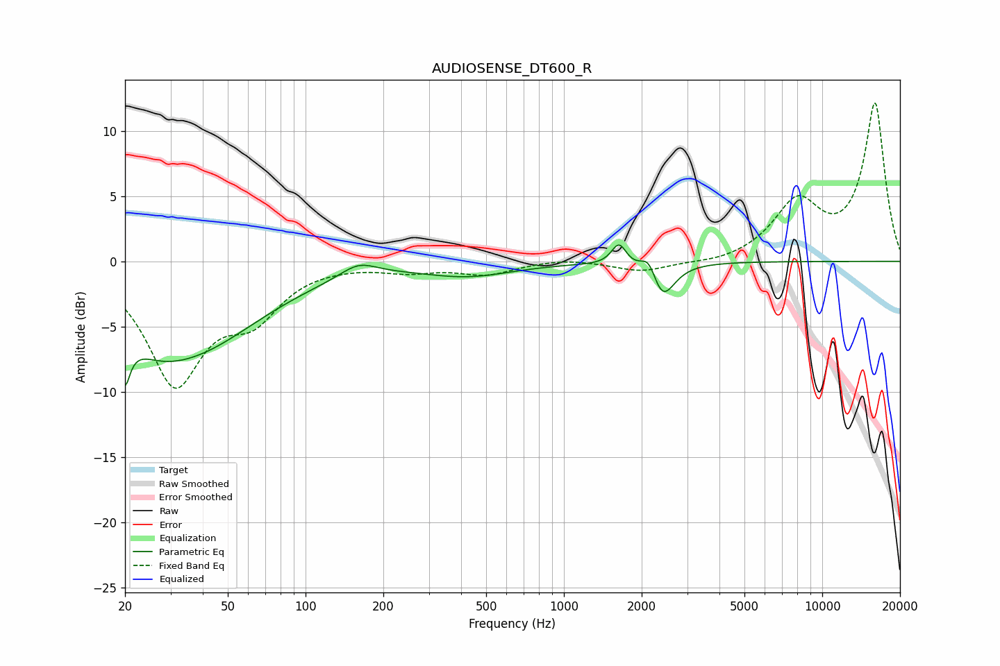

# AUDIOSENSE_DT600_R
See [usage instructions](https://github.com/jaakkopasanen/AutoEq#usage) for more options and info.

### Parametric EQs
Apply preamp of -1.3 dB when using parametric equalizer.

|   # | Type    |   Fc (Hz) |    Q |   Gain (dB) |
|-----|---------|-----------|------|-------------|
|   1 | Peaking |        20 | 5.9  |        -7.3 |
|   2 | Peaking |        20 | 5.81 |         3.3 |
|   3 | Peaking |        26 | 1.21 |        -1.5 |
|   4 | Peaking |        36 | 0.52 |        -6.4 |
|   5 | Peaking |       160 | 2    |         1.1 |
|   6 | Peaking |       426 | 0.81 |        -1   |
|   7 | Peaking |      1634 | 4.96 |         1.7 |
|   8 | Peaking |      2138 | 3.9  |         2.7 |
|   9 | Peaking |      2145 | 2.61 |        -1.3 |
|  10 | Peaking |      2392 | 3.11 |        -2.8 |

### Fixed Band EQs
When using fixed band (also called graphic) equalizer, apply preamp of **-12.2 dB** (if available) and set gains manually with these parameters.

|   # | Type    |   Fc (Hz) |    Q |   Gain (dB) |
|-----|---------|-----------|------|-------------|
|   1 | Peaking |        31 | 1.41 |        -9.1 |
|   2 | Peaking |        62 | 1.41 |        -3.5 |
|   3 | Peaking |       125 | 1.41 |        -0   |
|   4 | Peaking |       250 | 1.41 |        -0.6 |
|   5 | Peaking |       500 | 1.41 |        -0.9 |
|   6 | Peaking |      1000 | 1.41 |         0.3 |
|   7 | Peaking |      2000 | 1.41 |        -0.8 |
|   8 | Peaking |      4000 | 1.41 |        -0.3 |
|   9 | Peaking |      8000 | 1.41 |         4.3 |
|  10 | Peaking |     16000 | 1.41 |        12   |

### Graphs

