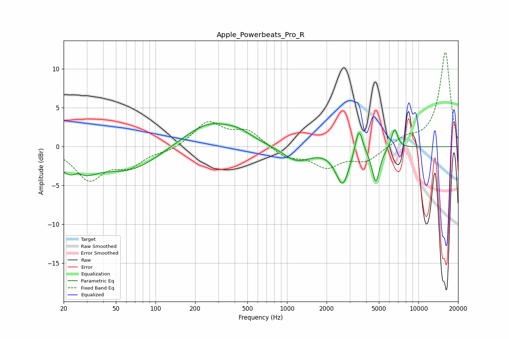

# Apple_Powerbeats_Pro_R
See [usage instructions](https://github.com/jaakkopasanen/AutoEq#usage) for more options and info.

### Parametric EQs
Apply preamp of -3.1 dB when using parametric equalizer.

|   # | Type    |   Fc (Hz) |    Q |   Gain (dB) |
|-----|---------|-----------|------|-------------|
|   1 | Peaking |        25 | 1.16 |        -3.7 |
|   2 | Peaking |        26 | 3.58 |         1.1 |
|   3 | Peaking |        65 | 0.66 |        -2.9 |
|   4 | Peaking |       258 | 0.73 |         3.2 |
|   5 | Peaking |       431 | 1.46 |         0.8 |
|   6 | Peaking |      1185 | 1.32 |        -1.9 |
|   7 | Peaking |      2648 | 2.73 |        -4.7 |
|   8 | Peaking |      3518 | 5.09 |         3.6 |
|   9 | Peaking |      4736 | 4.87 |        -4.4 |
|  10 | Peaking |      6578 | 5.89 |         2.6 |

### Fixed Band EQs
When using fixed band (also called graphic) equalizer, apply preamp of **-12.2 dB** (if available) and set gains manually with these parameters.

|   # | Type    |   Fc (Hz) |    Q |   Gain (dB) |
|-----|---------|-----------|------|-------------|
|   1 | Peaking |        31 | 1.41 |        -4.1 |
|   2 | Peaking |        62 | 1.41 |        -2.2 |
|   3 | Peaking |       125 | 1.41 |        -0.6 |
|   4 | Peaking |       250 | 1.41 |         3.1 |
|   5 | Peaking |       500 | 1.41 |         2   |
|   6 | Peaking |      1000 | 1.41 |        -1.4 |
|   7 | Peaking |      2000 | 1.41 |        -2.4 |
|   8 | Peaking |      4000 | 1.41 |        -1.8 |
|   9 | Peaking |      8000 | 1.41 |         1   |
|  10 | Peaking |     16000 | 1.41 |        12.2 |

### Graphs

