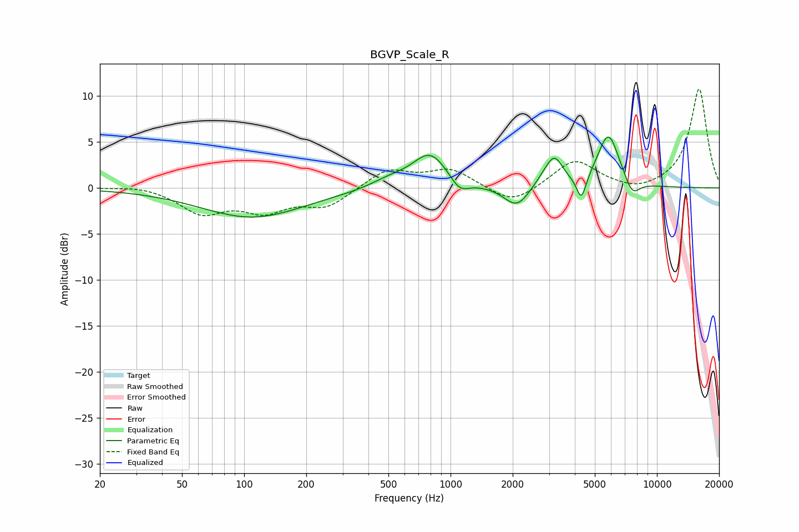

# BGVP_Scale_R
See [usage instructions](https://github.com/jaakkopasanen/AutoEq#usage) for more options and info.

### Parametric EQs
Apply preamp of -5.6 dB when using parametric equalizer.

|   # | Type    |   Fc (Hz) |    Q |   Gain (dB) |
|-----|---------|-----------|------|-------------|
|   1 | Peaking |       110 | 0.56 |        -3.2 |
|   2 | Peaking |       504 | 1.56 |         0.8 |
|   3 | Peaking |       797 | 1.63 |         3.8 |
|   4 | Peaking |      1105 | 3.07 |        -1.5 |
|   5 | Peaking |      2097 | 2.28 |        -2.4 |
|   6 | Peaking |      2831 | 2.62 |         0.8 |
|   7 | Peaking |      3188 | 3.44 |         2.8 |
|   8 | Peaking |      4304 | 5.95 |        -2.7 |
|   9 | Peaking |      5820 | 2.57 |         5.9 |
|  10 | Peaking |      7584 | 3.64 |        -1.8 |

### Fixed Band EQs
When using fixed band (also called graphic) equalizer, apply preamp of **-10.8 dB** (if available) and set gains manually with these parameters.

|   # | Type    |   Fc (Hz) |    Q |   Gain (dB) |
|-----|---------|-----------|------|-------------|
|   1 | Peaking |        31 | 1.41 |         0.3 |
|   2 | Peaking |        62 | 1.41 |        -2.6 |
|   3 | Peaking |       125 | 1.41 |        -2.2 |
|   4 | Peaking |       250 | 1.41 |        -2   |
|   5 | Peaking |       500 | 1.41 |         2   |
|   6 | Peaking |      1000 | 1.41 |         2   |
|   7 | Peaking |      2000 | 1.41 |        -1.9 |
|   8 | Peaking |      4000 | 1.41 |         3.1 |
|   9 | Peaking |      8000 | 1.41 |        -0.6 |
|  10 | Peaking |     16000 | 1.41 |        10.8 |

### Graphs

