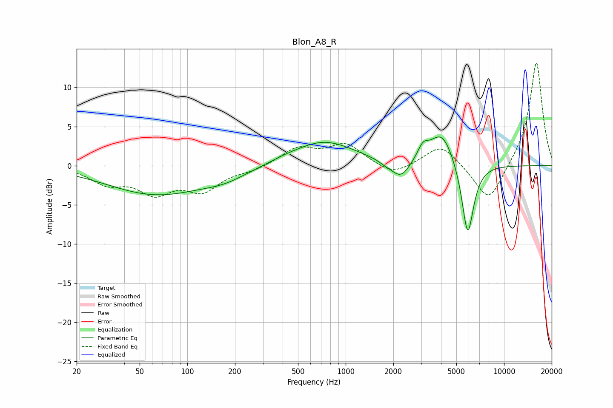

# Blon_A8_R
See [usage instructions](https://github.com/jaakkopasanen/AutoEq#usage) for more options and info.

### Parametric EQs
Apply preamp of -3.8 dB when using parametric equalizer.

|   # | Type    |   Fc (Hz) |    Q |   Gain (dB) |
|-----|---------|-----------|------|-------------|
|   1 | Peaking |        64 | 0.45 |        -3.6 |
|   2 | Peaking |       174 | 1.02 |        -0.9 |
|   3 | Peaking |       411 | 1.46 |         0.3 |
|   4 | Peaking |       728 | 0.73 |         3.1 |
|   5 | Peaking |      1789 | 3.26 |        -0.3 |
|   6 | Peaking |      2228 | 2.38 |        -2.3 |
|   7 | Peaking |      3076 | 4.09 |         1.6 |
|   8 | Peaking |      4049 | 1.8  |         4.4 |
|   9 | Peaking |      5897 | 3.94 |        -8   |
|  10 | Peaking |      5917 | 2.38 |        -1.6 |

### Fixed Band EQs
When using fixed band (also called graphic) equalizer, apply preamp of **-13.2 dB** (if available) and set gains manually with these parameters.

|   # | Type    |   Fc (Hz) |    Q |   Gain (dB) |
|-----|---------|-----------|------|-------------|
|   1 | Peaking |        31 | 1.41 |        -2   |
|   2 | Peaking |        62 | 1.41 |        -3.1 |
|   3 | Peaking |       125 | 1.41 |        -2.9 |
|   4 | Peaking |       250 | 1.41 |        -0.6 |
|   5 | Peaking |       500 | 1.41 |         2.1 |
|   6 | Peaking |      1000 | 1.41 |         2.6 |
|   7 | Peaking |      2000 | 1.41 |        -1.4 |
|   8 | Peaking |      4000 | 1.41 |         2.8 |
|   9 | Peaking |      8000 | 1.41 |        -5   |
|  10 | Peaking |     16000 | 1.41 |        13.4 |

### Graphs

