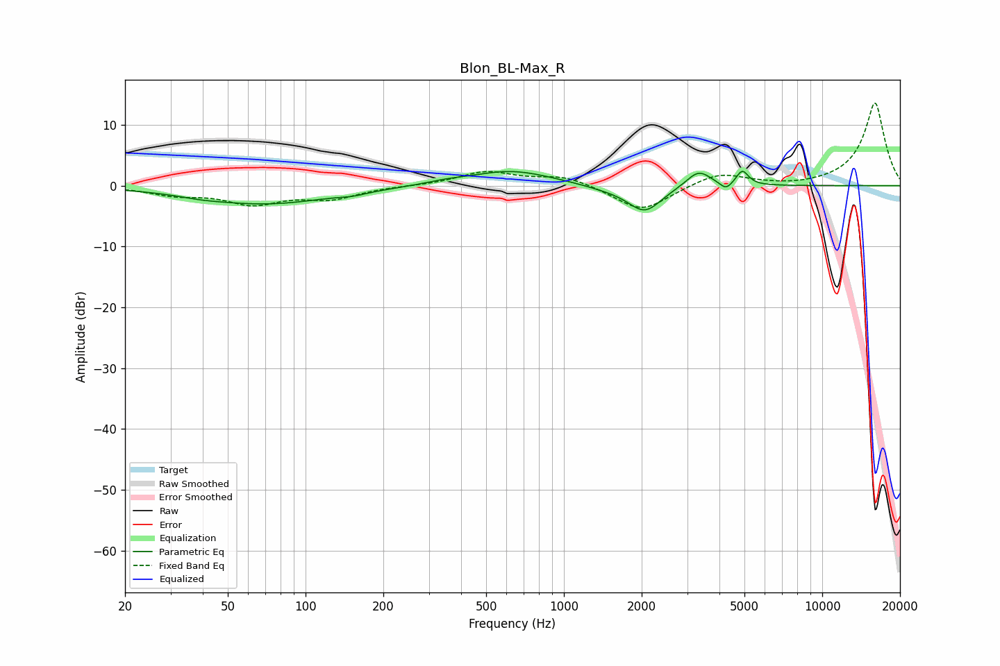

# Blon_BL-Max_R
See [usage instructions](https://github.com/jaakkopasanen/AutoEq#usage) for more options and info.

### Parametric EQs
Apply preamp of -2.5 dB when using parametric equalizer.

|   # | Type    |   Fc (Hz) |    Q |   Gain (dB) |
|-----|---------|-----------|------|-------------|
|   1 | Peaking |        40 | 1.93 |        -0.3 |
|   2 | Peaking |        70 | 0.54 |        -3   |
|   3 | Peaking |       153 | 2.76 |        -0.4 |
|   4 | Peaking |       349 | 1.82 |         0.4 |
|   5 | Peaking |       623 | 0.88 |         2.5 |
|   6 | Peaking |      1451 | 1.46 |        -0.5 |
|   7 | Peaking |      2055 | 2.14 |        -4.3 |
|   8 | Peaking |      3322 | 2.96 |         2.8 |
|   9 | Peaking |      4244 | 6    |        -1.3 |
|  10 | Peaking |      4903 | 5.99 |         2.4 |

### Fixed Band EQs
When using fixed band (also called graphic) equalizer, apply preamp of **-13.7 dB** (if available) and set gains manually with these parameters.

|   # | Type    |   Fc (Hz) |    Q |   Gain (dB) |
|-----|---------|-----------|------|-------------|
|   1 | Peaking |        31 | 1.41 |        -1.3 |
|   2 | Peaking |        62 | 1.41 |        -2.8 |
|   3 | Peaking |       125 | 1.41 |        -2   |
|   4 | Peaking |       250 | 1.41 |        -0   |
|   5 | Peaking |       500 | 1.41 |         2.2 |
|   6 | Peaking |      1000 | 1.41 |         1.6 |
|   7 | Peaking |      2000 | 1.41 |        -4.3 |
|   8 | Peaking |      4000 | 1.41 |         2.2 |
|   9 | Peaking |      8000 | 1.41 |        -0.3 |
|  10 | Peaking |     16000 | 1.41 |        13.7 |

### Graphs

