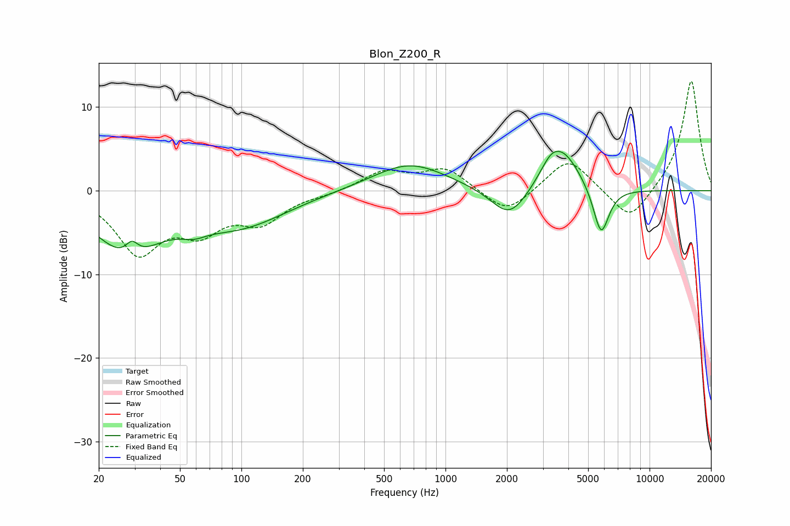

# Blon_Z200_R
See [usage instructions](https://github.com/jaakkopasanen/AutoEq#usage) for more options and info.

### Parametric EQs
Apply preamp of -4.8 dB when using parametric equalizer.

|   # | Type    |   Fc (Hz) |    Q |   Gain (dB) |
|-----|---------|-----------|------|-------------|
|   1 | Peaking |        27 | 0.86 |        -6.8 |
|   2 | Peaking |        29 | 4.66 |         1.6 |
|   3 | Peaking |        58 | 2.35 |        -0.9 |
|   4 | Peaking |        98 | 0.61 |        -3.9 |
|   5 | Peaking |       666 | 0.77 |         3.3 |
|   6 | Peaking |      2059 | 1.57 |        -3.8 |
|   7 | Peaking |      3430 | 2.12 |         4.8 |
|   8 | Peaking |      3523 | 3.52 |        -0.8 |
|   9 | Peaking |      4002 | 1.69 |         2.3 |
|  10 | Peaking |      5787 | 3.54 |        -5.9 |

### Fixed Band EQs
When using fixed band (also called graphic) equalizer, apply preamp of **-13.2 dB** (if available) and set gains manually with these parameters.

|   # | Type    |   Fc (Hz) |    Q |   Gain (dB) |
|-----|---------|-----------|------|-------------|
|   1 | Peaking |        31 | 1.41 |        -7.1 |
|   2 | Peaking |        62 | 1.41 |        -4   |
|   3 | Peaking |       125 | 1.41 |        -3.4 |
|   4 | Peaking |       250 | 1.41 |        -0.3 |
|   5 | Peaking |       500 | 1.41 |         2.2 |
|   6 | Peaking |      1000 | 1.41 |         2.6 |
|   7 | Peaking |      2000 | 1.41 |        -3   |
|   8 | Peaking |      4000 | 1.41 |         4   |
|   9 | Peaking |      8000 | 1.41 |        -4   |
|  10 | Peaking |     16000 | 1.41 |        13.4 |

### Graphs

