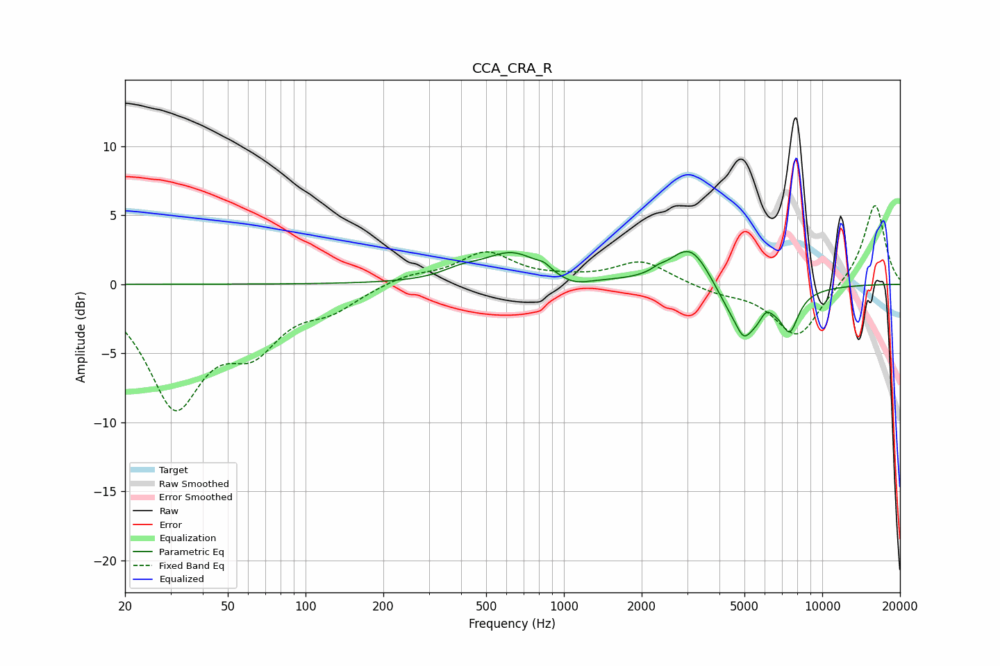

# CCA_CRA_R
See [usage instructions](https://github.com/jaakkopasanen/AutoEq#usage) for more options and info.

### Parametric EQs
Apply preamp of -2.5 dB when using parametric equalizer.

|   # | Type    |   Fc (Hz) |    Q |   Gain (dB) |
|-----|---------|-----------|------|-------------|
|   1 | Peaking |       398 | 1.95 |         0.6 |
|   2 | Peaking |       632 | 1.25 |         2.2 |
|   3 | Peaking |       837 | 6    |         0.3 |
|   4 | Peaking |      1084 | 2.22 |        -0.6 |
|   5 | Peaking |      2317 | 6    |         0.2 |
|   6 | Peaking |      3105 | 1.69 |         3.3 |
|   7 | Peaking |      4960 | 6    |        -0.7 |
|   8 | Peaking |      5028 | 1.54 |        -3.8 |
|   9 | Peaking |      6068 | 6    |         0.8 |
|  10 | Peaking |      7493 | 4.07 |        -2.5 |

### Fixed Band EQs
When using fixed band (also called graphic) equalizer, apply preamp of **-5.8 dB** (if available) and set gains manually with these parameters.

|   # | Type    |   Fc (Hz) |    Q |   Gain (dB) |
|-----|---------|-----------|------|-------------|
|   1 | Peaking |        31 | 1.41 |        -8.4 |
|   2 | Peaking |        62 | 1.41 |        -3.7 |
|   3 | Peaking |       125 | 1.41 |        -1.5 |
|   4 | Peaking |       250 | 1.41 |         0.7 |
|   5 | Peaking |       500 | 1.41 |         2.2 |
|   6 | Peaking |      1000 | 1.41 |         0.3 |
|   7 | Peaking |      2000 | 1.41 |         1.7 |
|   8 | Peaking |      4000 | 1.41 |        -0.5 |
|   9 | Peaking |      8000 | 1.41 |        -3.9 |
|  10 | Peaking |     16000 | 1.41 |         5.9 |

### Graphs

