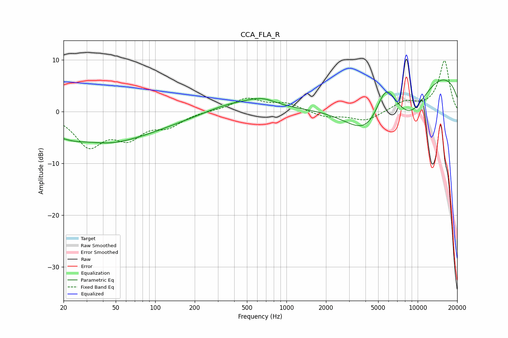

# CCA_FLA_R
See [usage instructions](https://github.com/jaakkopasanen/AutoEq#usage) for more options and info.

### Parametric EQs
Apply preamp of -6.2 dB when using parametric equalizer.

|   # | Type    |   Fc (Hz) |    Q |   Gain (dB) |
|-----|---------|-----------|------|-------------|
|   1 | Peaking |        24 | 1.85 |        -0.1 |
|   2 | Peaking |        29 | 0.4  |        -4.2 |
|   3 | Peaking |        32 | 1.44 |         0.6 |
|   4 | Peaking |        63 | 0.34 |        -2.8 |
|   5 | Peaking |       371 | 0.74 |         1.6 |
|   6 | Peaking |       648 | 1.2  |         1.8 |
|   7 | Peaking |      4309 | 0.69 |       -10.2 |
|   8 | Peaking |      5706 | 1.58 |         8.4 |
|   9 | Peaking |      8910 | 0.6  |       -12.9 |
|  10 | Peaking |     10000 | 0.28 |        15.2 |

### Fixed Band EQs
When using fixed band (also called graphic) equalizer, apply preamp of **-9.9 dB** (if available) and set gains manually with these parameters.

|   # | Type    |   Fc (Hz) |    Q |   Gain (dB) |
|-----|---------|-----------|------|-------------|
|   1 | Peaking |        31 | 1.41 |        -6.2 |
|   2 | Peaking |        62 | 1.41 |        -4.3 |
|   3 | Peaking |       125 | 1.41 |        -2.4 |
|   4 | Peaking |       250 | 1.41 |         0.1 |
|   5 | Peaking |       500 | 1.41 |         2.5 |
|   6 | Peaking |      1000 | 1.41 |         1.5 |
|   7 | Peaking |      2000 | 1.41 |        -1   |
|   8 | Peaking |      4000 | 1.41 |        -1.8 |
|   9 | Peaking |      8000 | 1.41 |         1.8 |
|  10 | Peaking |     16000 | 1.41 |         9.8 |

### Graphs

