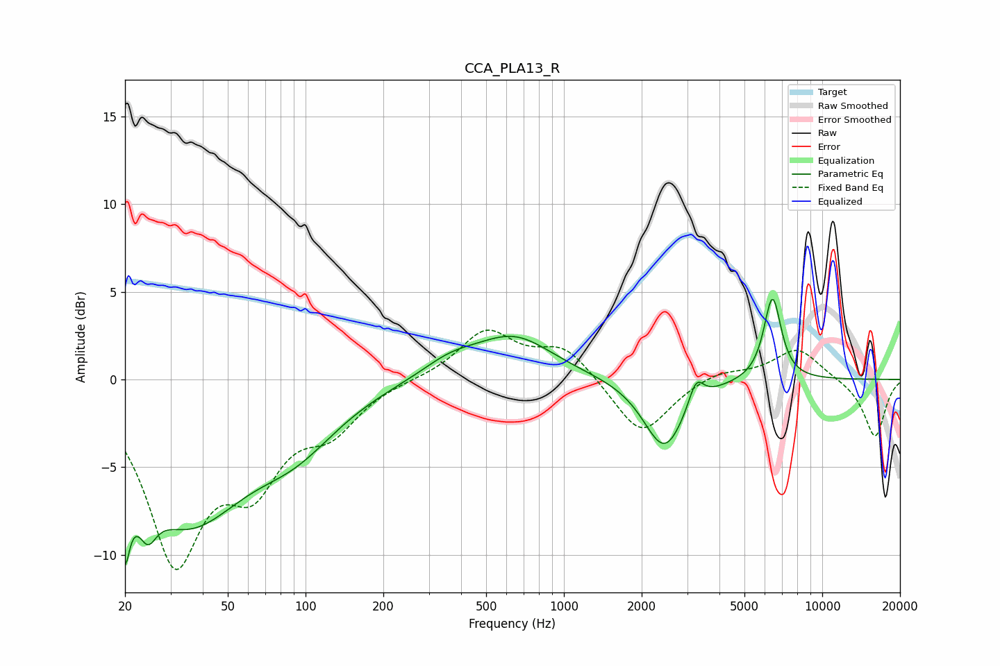

# CCA_PLA13_R
See [usage instructions](https://github.com/jaakkopasanen/AutoEq#usage) for more options and info.

### Parametric EQs
Apply preamp of -4.7 dB when using parametric equalizer.

|   # | Type    |   Fc (Hz) |    Q |   Gain (dB) |
|-----|---------|-----------|------|-------------|
|   1 | Peaking |        20 | 5.56 |        -8.2 |
|   2 | Peaking |        20 | 5.52 |         3.5 |
|   3 | Peaking |        24 | 4.17 |        -2   |
|   4 | Peaking |        35 | 0.61 |        -7.7 |
|   5 | Peaking |        92 | 0.86 |        -2.4 |
|   6 | Peaking |       363 | 1.25 |         0.9 |
|   7 | Peaking |       642 | 0.93 |         2.4 |
|   8 | Peaking |      2451 | 1.77 |        -4.1 |
|   9 | Peaking |      3248 | 4.88 |         1.5 |
|  10 | Peaking |      6418 | 4.09 |         4.8 |

### Fixed Band EQs
When using fixed band (also called graphic) equalizer, apply preamp of **-2.9 dB** (if available) and set gains manually with these parameters.

|   # | Type    |   Fc (Hz) |    Q |   Gain (dB) |
|-----|---------|-----------|------|-------------|
|   1 | Peaking |        31 | 1.41 |        -9.9 |
|   2 | Peaking |        62 | 1.41 |        -4.8 |
|   3 | Peaking |       125 | 1.41 |        -2.4 |
|   4 | Peaking |       250 | 1.41 |         0   |
|   5 | Peaking |       500 | 1.41 |         2.7 |
|   6 | Peaking |      1000 | 1.41 |         1.8 |
|   7 | Peaking |      2000 | 1.41 |        -3.3 |
|   8 | Peaking |      4000 | 1.41 |         0.5 |
|   9 | Peaking |      8000 | 1.41 |         1.8 |
|  10 | Peaking |     16000 | 1.41 |        -3.3 |

### Graphs

