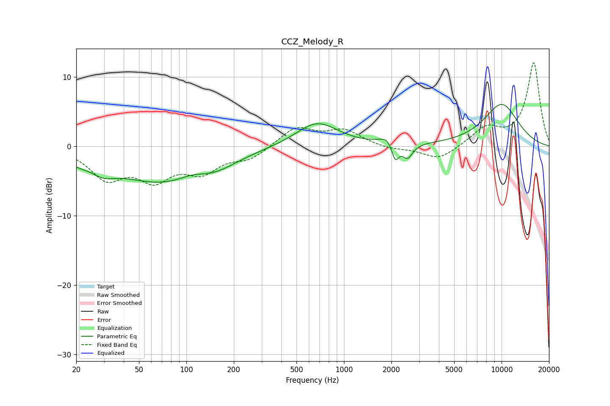

# CCZ_Melody_R
See [usage instructions](https://github.com/jaakkopasanen/AutoEq#usage) for more options and info.

### Parametric EQs
Apply preamp of -6.2 dB when using parametric equalizer.

|   # | Type    |   Fc (Hz) |    Q |   Gain (dB) |
|-----|---------|-----------|------|-------------|
|   1 | Peaking |        20 | 2.31 |        -0.8 |
|   2 | Peaking |        29 | 1.78 |        -1.6 |
|   3 | Peaking |        68 | 0.47 |        -4.9 |
|   4 | Peaking |       109 | 1.82 |         0.6 |
|   5 | Peaking |       154 | 1.05 |        -1.2 |
|   6 | Peaking |       676 | 1.06 |         3.5 |
|   7 | Peaking |      1932 | 2.82 |         1.4 |
|   8 | Peaking |      2109 | 5.89 |        -2.9 |
|   9 | Peaking |      2530 | 4.25 |        -2.1 |
|  10 | Peaking |     10000 | 1.04 |         6.1 |

### Fixed Band EQs
When using fixed band (also called graphic) equalizer, apply preamp of **-12.2 dB** (if available) and set gains manually with these parameters.

|   # | Type    |   Fc (Hz) |    Q |   Gain (dB) |
|-----|---------|-----------|------|-------------|
|   1 | Peaking |        31 | 1.41 |        -4.3 |
|   2 | Peaking |        62 | 1.41 |        -4.2 |
|   3 | Peaking |       125 | 1.41 |        -3.2 |
|   4 | Peaking |       250 | 1.41 |        -1.7 |
|   5 | Peaking |       500 | 1.41 |         2.7 |
|   6 | Peaking |      1000 | 1.41 |         2.2 |
|   7 | Peaking |      2000 | 1.41 |        -0.4 |
|   8 | Peaking |      4000 | 1.41 |        -2   |
|   9 | Peaking |      8000 | 1.41 |         2.5 |
|  10 | Peaking |     16000 | 1.41 |        12   |

### Graphs

