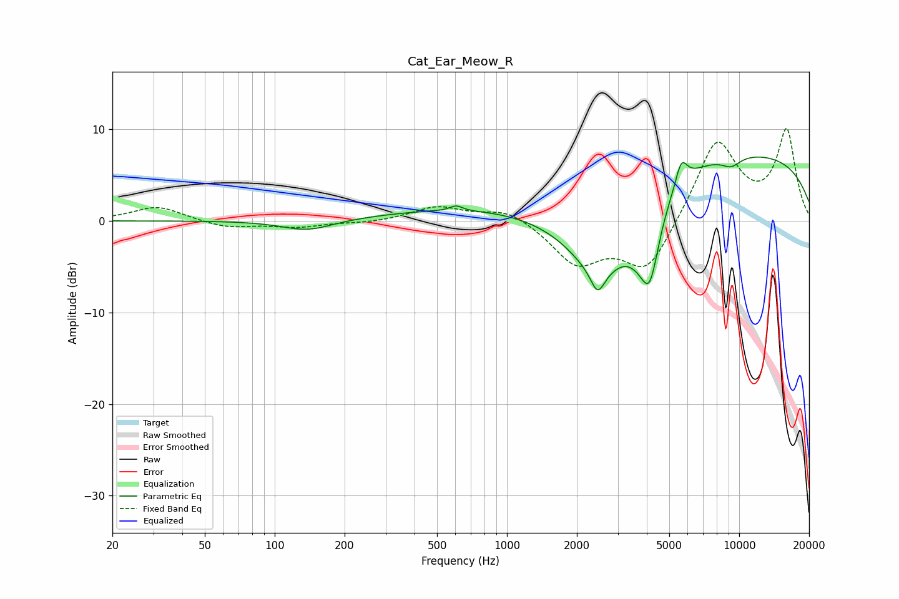

# Cat_Ear_Meow_R
See [usage instructions](https://github.com/jaakkopasanen/AutoEq#usage) for more options and info.

### Parametric EQs
Apply preamp of -7.1 dB when using parametric equalizer.

|   # | Type    |   Fc (Hz) |    Q |   Gain (dB) |
|-----|---------|-----------|------|-------------|
|   1 | Peaking |       139 | 1.28 |        -1.2 |
|   2 | Peaking |       605 | 5.61 |         0.6 |
|   3 | Peaking |      1635 | 0.19 |         1.9 |
|   4 | Peaking |      2457 | 4.98 |        -2.4 |
|   5 | Peaking |      2532 | 0.89 |        -9.7 |
|   6 | Peaking |      3749 | 2.23 |        -2.6 |
|   7 | Peaking |      4129 | 3.54 |        -6.6 |
|   8 | Peaking |      5636 | 5.5  |         2.7 |
|   9 | Peaking |      9228 | 2.96 |        -1.1 |
|  10 | Peaking |     10000 | 0.21 |         7.3 |

### Fixed Band EQs
When using fixed band (also called graphic) equalizer, apply preamp of **-10.2 dB** (if available) and set gains manually with these parameters.

|   # | Type    |   Fc (Hz) |    Q |   Gain (dB) |
|-----|---------|-----------|------|-------------|
|   1 | Peaking |        31 | 1.41 |         1.6 |
|   2 | Peaking |        62 | 1.41 |        -0.8 |
|   3 | Peaking |       125 | 1.41 |        -0.7 |
|   4 | Peaking |       250 | 1.41 |        -0.2 |
|   5 | Peaking |       500 | 1.41 |         1.5 |
|   6 | Peaking |      1000 | 1.41 |         1.4 |
|   7 | Peaking |      2000 | 1.41 |        -4.5 |
|   8 | Peaking |      4000 | 1.41 |        -5.6 |
|   9 | Peaking |      8000 | 1.41 |         8.9 |
|  10 | Peaking |     16000 | 1.41 |         9.7 |

### Graphs

