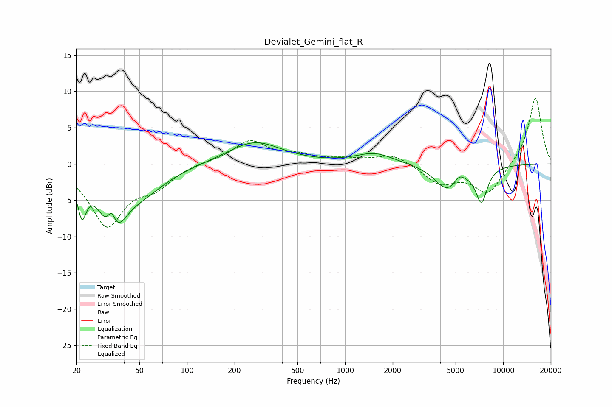

# Devialet_Gemini_flat_R
See [usage instructions](https://github.com/jaakkopasanen/AutoEq#usage) for more options and info.

### Parametric EQs
Apply preamp of -3.0 dB when using parametric equalizer.

|   # | Type    |   Fc (Hz) |    Q |   Gain (dB) |
|-----|---------|-----------|------|-------------|
|   1 | Peaking |        22 | 5.08 |        -5   |
|   2 | Peaking |        33 | 2.09 |        -6.7 |
|   3 | Peaking |        33 | 5.29 |         3.5 |
|   4 | Peaking |        37 | 2.45 |        -1.5 |
|   5 | Peaking |        50 | 0.88 |        -3.7 |
|   6 | Peaking |       267 | 0.84 |         3.1 |
|   7 | Peaking |      1536 | 1.2  |         1.5 |
|   8 | Peaking |      4427 | 1.73 |        -3.4 |
|   9 | Peaking |      5252 | 4.28 |         1   |
|  10 | Peaking |      7282 | 3.61 |        -4.8 |

### Fixed Band EQs
When using fixed band (also called graphic) equalizer, apply preamp of **-9.1 dB** (if available) and set gains manually with these parameters.

|   # | Type    |   Fc (Hz) |    Q |   Gain (dB) |
|-----|---------|-----------|------|-------------|
|   1 | Peaking |        31 | 1.41 |        -8.3 |
|   2 | Peaking |        62 | 1.41 |        -2.6 |
|   3 | Peaking |       125 | 1.41 |         0.3 |
|   4 | Peaking |       250 | 1.41 |         3.1 |
|   5 | Peaking |       500 | 1.41 |         1   |
|   6 | Peaking |      1000 | 1.41 |         0.5 |
|   7 | Peaking |      2000 | 1.41 |         1.4 |
|   8 | Peaking |      4000 | 1.41 |        -2.6 |
|   9 | Peaking |      8000 | 1.41 |        -4.1 |
|  10 | Peaking |     16000 | 1.41 |         9.3 |

### Graphs

