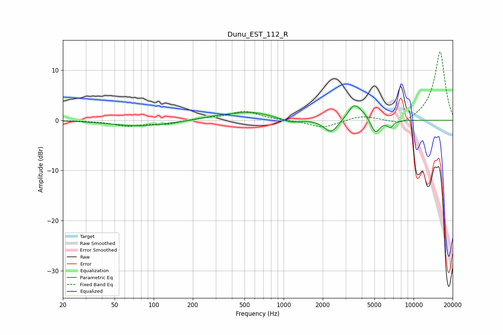

# Dunu_EST_112_R
See [usage instructions](https://github.com/jaakkopasanen/AutoEq#usage) for more options and info.

### Parametric EQs
Apply preamp of -3.0 dB when using parametric equalizer.

|   # | Type    |   Fc (Hz) |    Q |   Gain (dB) |
|-----|---------|-----------|------|-------------|
|   1 | Peaking |        78 | 0.64 |        -1.2 |
|   2 | Peaking |       301 | 1.27 |         0.5 |
|   3 | Peaking |       554 | 0.92 |         1.5 |
|   4 | Peaking |      1139 | 2.38 |        -0.7 |
|   5 | Peaking |      2321 | 2.64 |        -2.7 |
|   6 | Peaking |      3470 | 3    |         2.7 |
|   7 | Peaking |      4149 | 2.08 |         1.4 |
|   8 | Peaking |      4709 | 3.15 |        -0.6 |
|   9 | Peaking |      5100 | 4    |        -2.7 |
|  10 | Peaking |      6628 | 5.58 |        -1.3 |

### Fixed Band EQs
When using fixed band (also called graphic) equalizer, apply preamp of **-13.7 dB** (if available) and set gains manually with these parameters.

|   # | Type    |   Fc (Hz) |    Q |   Gain (dB) |
|-----|---------|-----------|------|-------------|
|   1 | Peaking |        31 | 1.41 |        -0.1 |
|   2 | Peaking |        62 | 1.41 |        -1.1 |
|   3 | Peaking |       125 | 1.41 |        -0.7 |
|   4 | Peaking |       250 | 1.41 |         0.4 |
|   5 | Peaking |       500 | 1.41 |         1.8 |
|   6 | Peaking |      1000 | 1.41 |         0   |
|   7 | Peaking |      2000 | 1.41 |        -1.5 |
|   8 | Peaking |      4000 | 1.41 |         0.9 |
|   9 | Peaking |      8000 | 1.41 |        -1.3 |
|  10 | Peaking |     16000 | 1.41 |        13.8 |

### Graphs

