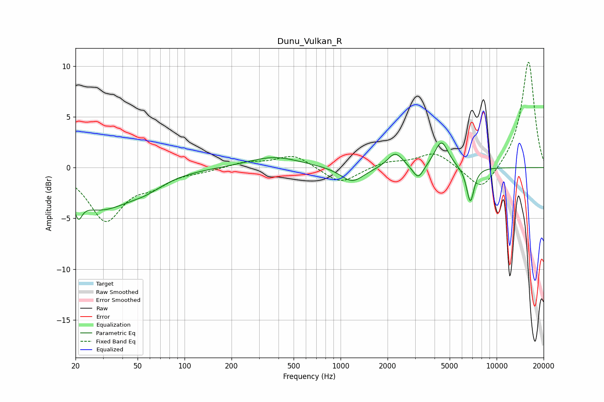

# Dunu_Vulkan_R
See [usage instructions](https://github.com/jaakkopasanen/AutoEq#usage) for more options and info.

### Parametric EQs
Apply preamp of -2.5 dB when using parametric equalizer.

|   # | Type    |   Fc (Hz) |    Q |   Gain (dB) |
|-----|---------|-----------|------|-------------|
|   1 | Peaking |        21 | 5.96 |        -4.6 |
|   2 | Peaking |        21 | 6    |         2.7 |
|   3 | Peaking |        29 | 0.71 |        -3.8 |
|   4 | Peaking |        57 | 1.22 |        -0.9 |
|   5 | Peaking |       375 | 0.85 |         1.1 |
|   6 | Peaking |      1188 | 1.89 |        -1.5 |
|   7 | Peaking |      2236 | 2.93 |         1.5 |
|   8 | Peaking |      3143 | 4.1  |        -1.4 |
|   9 | Peaking |      4427 | 3.17 |         2.6 |
|  10 | Peaking |      6784 | 5.44 |        -3.5 |

### Fixed Band EQs
When using fixed band (also called graphic) equalizer, apply preamp of **-10.5 dB** (if available) and set gains manually with these parameters.

|   # | Type    |   Fc (Hz) |    Q |   Gain (dB) |
|-----|---------|-----------|------|-------------|
|   1 | Peaking |        31 | 1.41 |        -5.1 |
|   2 | Peaking |        62 | 1.41 |        -1.3 |
|   3 | Peaking |       125 | 1.41 |        -0.3 |
|   4 | Peaking |       250 | 1.41 |         0.5 |
|   5 | Peaking |       500 | 1.41 |         1.3 |
|   6 | Peaking |      1000 | 1.41 |        -1.6 |
|   7 | Peaking |      2000 | 1.41 |         0.6 |
|   8 | Peaking |      4000 | 1.41 |         1.5 |
|   9 | Peaking |      8000 | 1.41 |        -2.5 |
|  10 | Peaking |     16000 | 1.41 |        10.6 |

### Graphs

