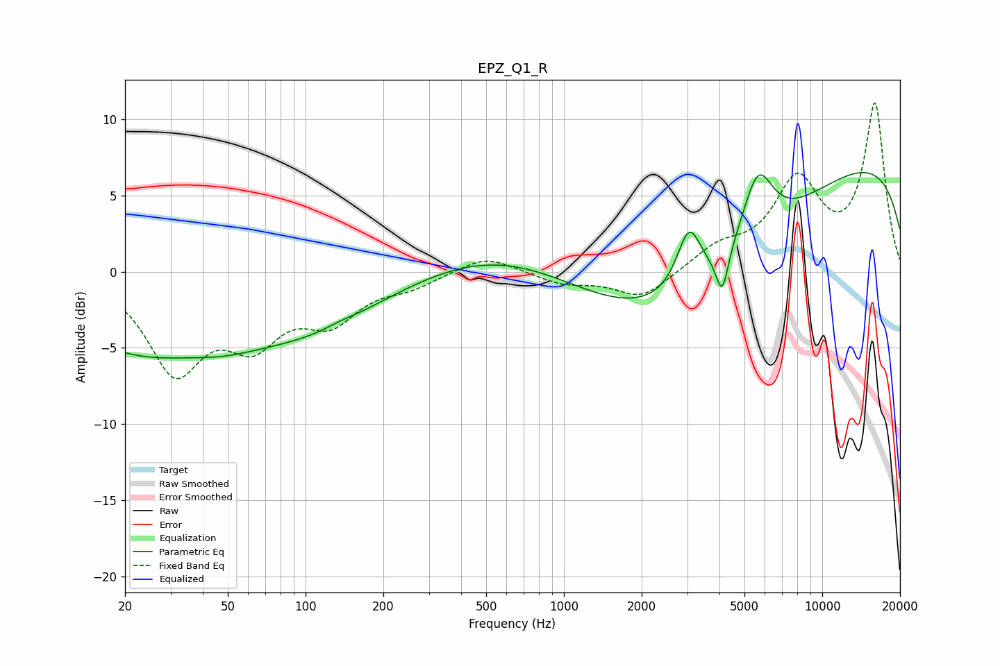

# EPZ_Q1_R
See [usage instructions](https://github.com/jaakkopasanen/AutoEq#usage) for more options and info.

### Parametric EQs
Apply preamp of -6.6 dB when using parametric equalizer.

|   # | Type    |   Fc (Hz) |    Q |   Gain (dB) |
|-----|---------|-----------|------|-------------|
|   1 | Peaking |        22 | 0.47 |        -4.6 |
|   2 | Peaking |        48 | 1.12 |        -0.6 |
|   3 | Peaking |        97 | 0.47 |        -3.5 |
|   4 | Peaking |       135 | 2.84 |         0.1 |
|   5 | Peaking |       770 | 0.4  |         3   |
|   6 | Peaking |      2796 | 0.32 |        -8   |
|   7 | Peaking |      3050 | 3.02 |         3.9 |
|   8 | Peaking |      4102 | 5.92 |        -2.8 |
|   9 | Peaking |      5629 | 2.27 |         4.7 |
|  10 | Peaking |     10000 | 0.18 |         8.1 |

### Fixed Band EQs
When using fixed band (also called graphic) equalizer, apply preamp of **-11.2 dB** (if available) and set gains manually with these parameters.

|   # | Type    |   Fc (Hz) |    Q |   Gain (dB) |
|-----|---------|-----------|------|-------------|
|   1 | Peaking |        31 | 1.41 |        -6.2 |
|   2 | Peaking |        62 | 1.41 |        -3.9 |
|   3 | Peaking |       125 | 1.41 |        -2.8 |
|   4 | Peaking |       250 | 1.41 |        -0.8 |
|   5 | Peaking |       500 | 1.41 |         1.1 |
|   6 | Peaking |      1000 | 1.41 |        -0.7 |
|   7 | Peaking |      2000 | 1.41 |        -1.8 |
|   8 | Peaking |      4000 | 1.41 |         1.4 |
|   9 | Peaking |      8000 | 1.41 |         5.7 |
|  10 | Peaking |     16000 | 1.41 |        10.8 |

### Graphs

