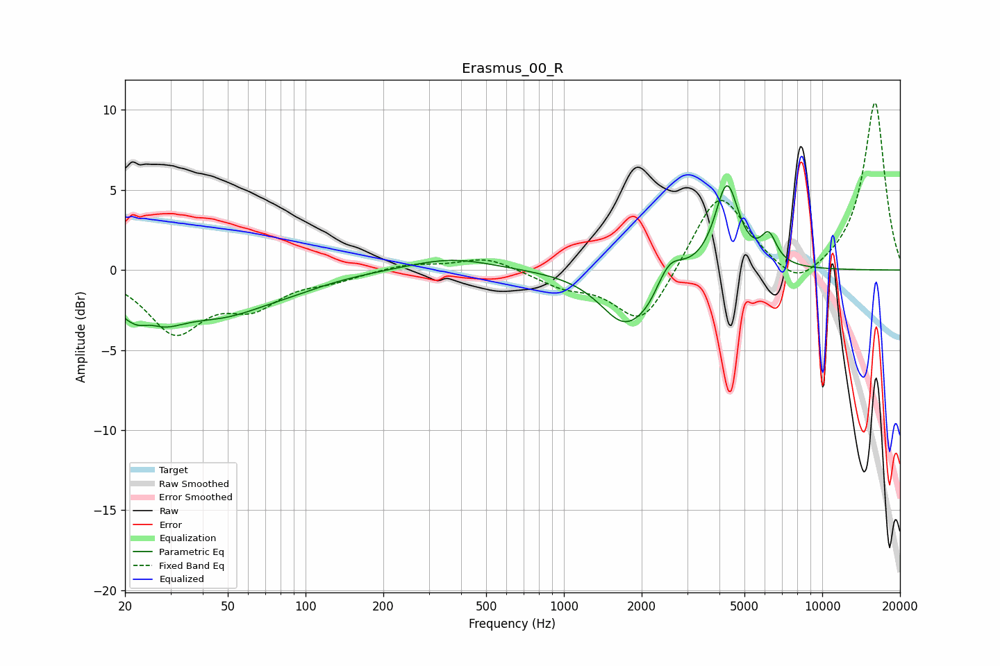

# Erasmus_00_R
See [usage instructions](https://github.com/jaakkopasanen/AutoEq#usage) for more options and info.

### Parametric EQs
Apply preamp of -5.4 dB when using parametric equalizer.

|   # | Type    |   Fc (Hz) |    Q |   Gain (dB) |
|-----|---------|-----------|------|-------------|
|   1 | Peaking |        24 | 1.34 |        -3.6 |
|   2 | Peaking |        25 | 2.92 |         1.1 |
|   3 | Peaking |        48 | 0.8  |        -2.1 |
|   4 | Peaking |        88 | 0.91 |        -0.5 |
|   5 | Peaking |       367 | 0.88 |         0.8 |
|   6 | Peaking |      1723 | 1.47 |        -3.3 |
|   7 | Peaking |      2149 | 2.49 |        -0.8 |
|   8 | Peaking |      2544 | 2.71 |         1.6 |
|   9 | Peaking |      4276 | 3.07 |         5.4 |
|  10 | Peaking |      6209 | 4.49 |         1.7 |

### Fixed Band EQs
When using fixed band (also called graphic) equalizer, apply preamp of **-10.5 dB** (if available) and set gains manually with these parameters.

|   # | Type    |   Fc (Hz) |    Q |   Gain (dB) |
|-----|---------|-----------|------|-------------|
|   1 | Peaking |        31 | 1.41 |        -3.7 |
|   2 | Peaking |        62 | 1.41 |        -1.9 |
|   3 | Peaking |       125 | 1.41 |        -0.5 |
|   4 | Peaking |       250 | 1.41 |         0.4 |
|   5 | Peaking |       500 | 1.41 |         0.8 |
|   6 | Peaking |      1000 | 1.41 |        -0.9 |
|   7 | Peaking |      2000 | 1.41 |        -3.6 |
|   8 | Peaking |      4000 | 1.41 |         5.1 |
|   9 | Peaking |      8000 | 1.41 |        -1.5 |
|  10 | Peaking |     16000 | 1.41 |        10.5 |

### Graphs

