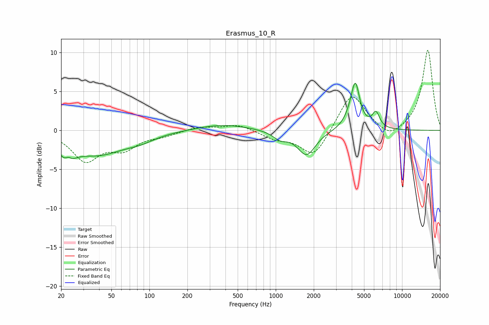

# Erasmus_10_R
See [usage instructions](https://github.com/jaakkopasanen/AutoEq#usage) for more options and info.

### Parametric EQs
Apply preamp of -6.2 dB when using parametric equalizer.

|   # | Type    |   Fc (Hz) |    Q |   Gain (dB) |
|-----|---------|-----------|------|-------------|
|   1 | Peaking |        22 | 2.85 |        -3.5 |
|   2 | Peaking |        23 | 4.57 |         1.9 |
|   3 | Peaking |        38 | 0.67 |        -2.9 |
|   4 | Peaking |        85 | 1.17 |        -0.7 |
|   5 | Peaking |       381 | 0.7  |         0.8 |
|   6 | Peaking |      1086 | 2.47 |        -0.9 |
|   7 | Peaking |      1754 | 1.99 |        -3.2 |
|   8 | Peaking |      4085 | 2.53 |         2   |
|   9 | Peaking |      4277 | 4.56 |         4.2 |
|  10 | Peaking |      6213 | 4.72 |         1.9 |

### Fixed Band EQs
When using fixed band (also called graphic) equalizer, apply preamp of **-10.4 dB** (if available) and set gains manually with these parameters.

|   # | Type    |   Fc (Hz) |    Q |   Gain (dB) |
|-----|---------|-----------|------|-------------|
|   1 | Peaking |        31 | 1.41 |        -3.7 |
|   2 | Peaking |        62 | 1.41 |        -2.1 |
|   3 | Peaking |       125 | 1.41 |        -0.6 |
|   4 | Peaking |       250 | 1.41 |         0.5 |
|   5 | Peaking |       500 | 1.41 |         0.8 |
|   6 | Peaking |      1000 | 1.41 |        -1   |
|   7 | Peaking |      2000 | 1.41 |        -3.5 |
|   8 | Peaking |      4000 | 1.41 |         5   |
|   9 | Peaking |      8000 | 1.41 |        -1.3 |
|  10 | Peaking |     16000 | 1.41 |        10.4 |

### Graphs

