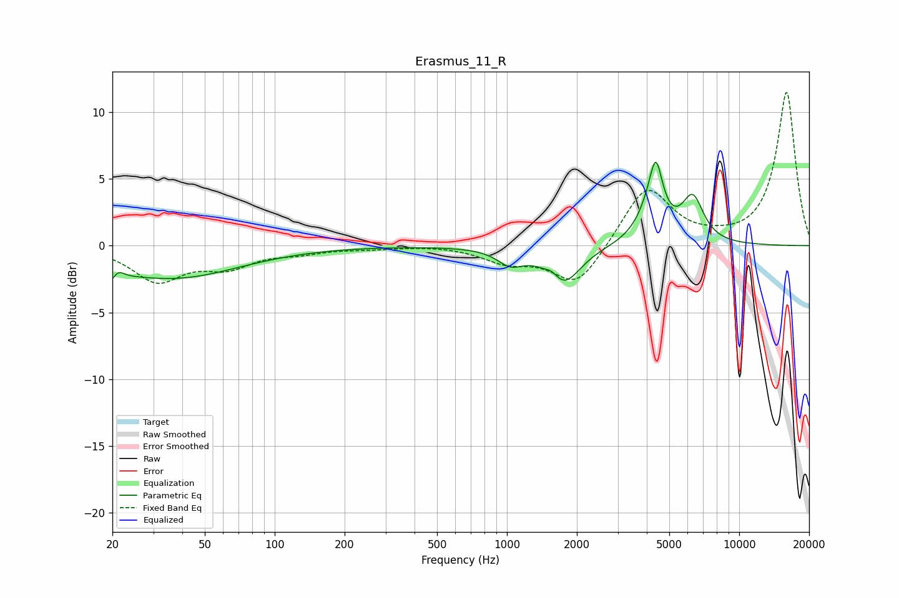

# Erasmus_11_R
See [usage instructions](https://github.com/jaakkopasanen/AutoEq#usage) for more options and info.

### Parametric EQs
Apply preamp of -6.4 dB when using parametric equalizer.

|   # | Type    |   Fc (Hz) |    Q |   Gain (dB) |
|-----|---------|-----------|------|-------------|
|   1 | Peaking |        20 | 3.58 |        -2.1 |
|   2 | Peaking |        21 | 4.84 |         1.7 |
|   3 | Peaking |        35 | 0.46 |        -1.8 |
|   4 | Peaking |        38 | 0.58 |        -0.6 |
|   5 | Peaking |      1036 | 2.51 |        -1.1 |
|   6 | Peaking |      1568 | 4.99 |         0.5 |
|   7 | Peaking |      1743 | 1.91 |        -2.8 |
|   8 | Peaking |      4210 | 2.34 |         2.5 |
|   9 | Peaking |      4379 | 5.31 |         3.5 |
|  10 | Peaking |      6312 | 2.95 |         3.3 |

### Fixed Band EQs
When using fixed band (also called graphic) equalizer, apply preamp of **-11.6 dB** (if available) and set gains manually with these parameters.

|   # | Type    |   Fc (Hz) |    Q |   Gain (dB) |
|-----|---------|-----------|------|-------------|
|   1 | Peaking |        31 | 1.41 |        -2.5 |
|   2 | Peaking |        62 | 1.41 |        -1.4 |
|   3 | Peaking |       125 | 1.41 |        -0.4 |
|   4 | Peaking |       250 | 1.41 |        -0.2 |
|   5 | Peaking |       500 | 1.41 |         0.1 |
|   6 | Peaking |      1000 | 1.41 |        -1.1 |
|   7 | Peaking |      2000 | 1.41 |        -3.1 |
|   8 | Peaking |      4000 | 1.41 |         4.5 |
|   9 | Peaking |      8000 | 1.41 |         0.2 |
|  10 | Peaking |     16000 | 1.41 |        11.5 |

### Graphs

