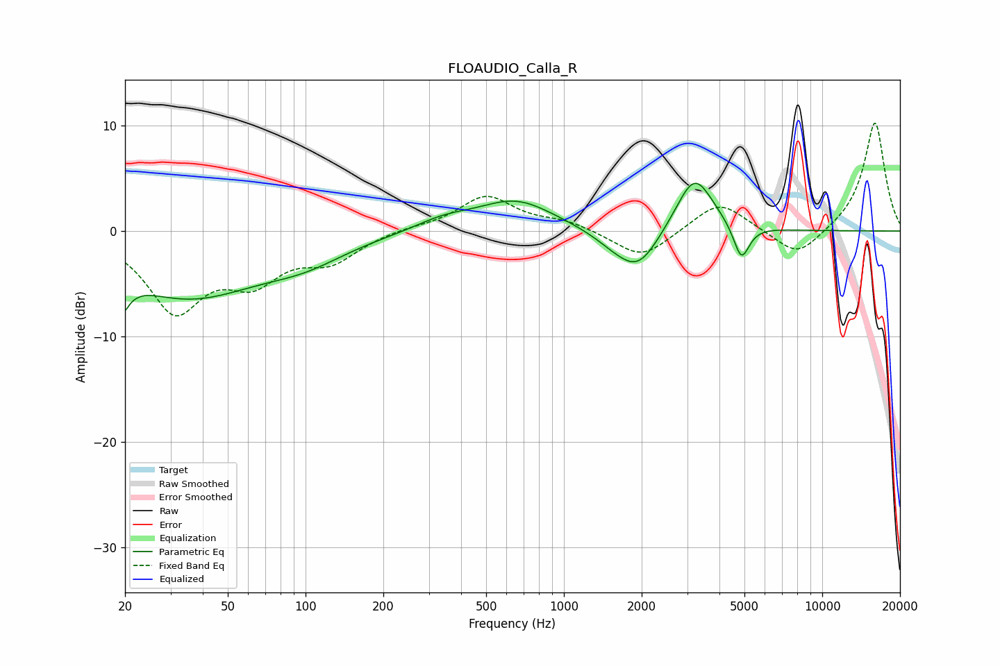

# FLOAUDIO_Calla_R
See [usage instructions](https://github.com/jaakkopasanen/AutoEq#usage) for more options and info.

### Parametric EQs
Apply preamp of -4.6 dB when using parametric equalizer.

|   # | Type    |   Fc (Hz) |    Q |   Gain (dB) |
|-----|---------|-----------|------|-------------|
|   1 | Peaking |        20 | 5.27 |        -6.1 |
|   2 | Peaking |        20 | 5.96 |         3.2 |
|   3 | Peaking |        35 | 0.49 |        -6.1 |
|   4 | Peaking |       100 | 0.89 |        -1.6 |
|   5 | Peaking |       342 | 1.28 |         0.9 |
|   6 | Peaking |       652 | 0.95 |         2.9 |
|   7 | Peaking |      1589 | 1.56 |        -1.1 |
|   8 | Peaking |      1950 | 1.74 |        -3.5 |
|   9 | Peaking |      3204 | 1.95 |         5.5 |
|  10 | Peaking |      4863 | 4.54 |        -3.4 |

### Fixed Band EQs
When using fixed band (also called graphic) equalizer, apply preamp of **-10.3 dB** (if available) and set gains manually with these parameters.

|   # | Type    |   Fc (Hz) |    Q |   Gain (dB) |
|-----|---------|-----------|------|-------------|
|   1 | Peaking |        31 | 1.41 |        -7.2 |
|   2 | Peaking |        62 | 1.41 |        -3.9 |
|   3 | Peaking |       125 | 1.41 |        -2.5 |
|   4 | Peaking |       250 | 1.41 |         0.3 |
|   5 | Peaking |       500 | 1.41 |         3.3 |
|   6 | Peaking |      1000 | 1.41 |         0.8 |
|   7 | Peaking |      2000 | 1.41 |        -2.7 |
|   8 | Peaking |      4000 | 1.41 |         2.9 |
|   9 | Peaking |      8000 | 1.41 |        -2.7 |
|  10 | Peaking |     16000 | 1.41 |        10.4 |

### Graphs

