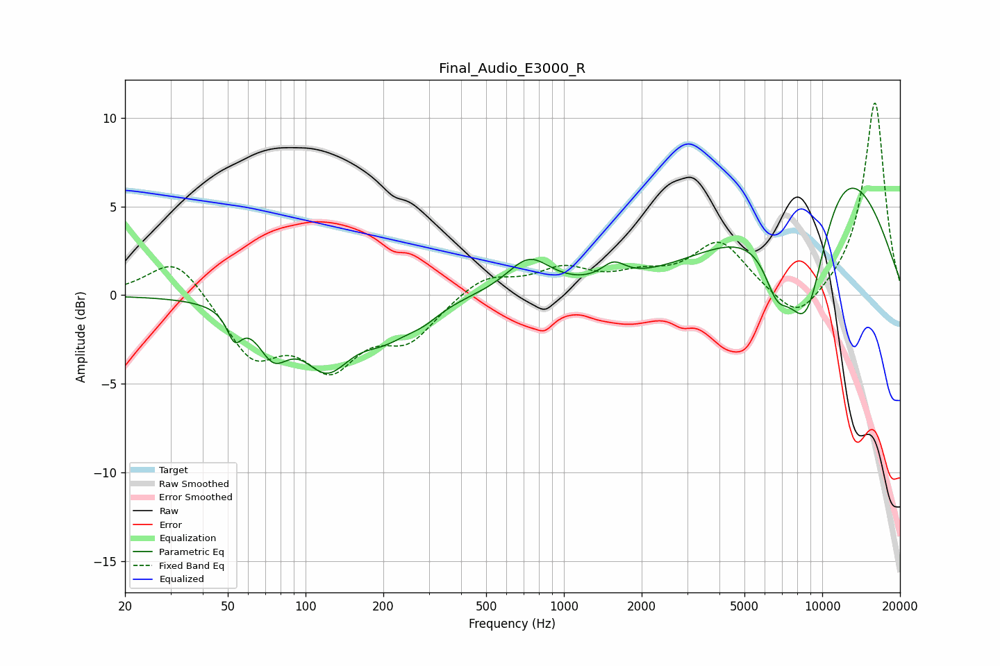

# Final_Audio_E3000_R
See [usage instructions](https://github.com/jaakkopasanen/AutoEq#usage) for more options and info.

### Parametric EQs
Apply preamp of -6.1 dB when using parametric equalizer.

|   # | Type    |   Fc (Hz) |    Q |   Gain (dB) |
|-----|---------|-----------|------|-------------|
|   1 | Peaking |        53 | 5.01 |        -1.5 |
|   2 | Peaking |        75 | 2.33 |        -2.5 |
|   3 | Peaking |       121 | 1.52 |        -3.5 |
|   4 | Peaking |       203 | 1.35 |        -1.7 |
|   5 | Peaking |       286 | 2    |        -0.7 |
|   6 | Peaking |       732 | 1.67 |         1.9 |
|   7 | Peaking |      1556 | 3.09 |         0.9 |
|   8 | Peaking |      6661 | 2.74 |        -2.3 |
|   9 | Peaking |      8675 | 1.19 |       -11.4 |
|  10 | Peaking |     10000 | 0.47 |        11.6 |

### Fixed Band EQs
When using fixed band (also called graphic) equalizer, apply preamp of **-10.9 dB** (if available) and set gains manually with these parameters.

|   # | Type    |   Fc (Hz) |    Q |   Gain (dB) |
|-----|---------|-----------|------|-------------|
|   1 | Peaking |        31 | 1.41 |         2.3 |
|   2 | Peaking |        62 | 1.41 |        -3.3 |
|   3 | Peaking |       125 | 1.41 |        -3.6 |
|   4 | Peaking |       250 | 1.41 |        -2.2 |
|   5 | Peaking |       500 | 1.41 |         1.1 |
|   6 | Peaking |      1000 | 1.41 |         1.3 |
|   7 | Peaking |      2000 | 1.41 |         0.9 |
|   8 | Peaking |      4000 | 1.41 |         2.9 |
|   9 | Peaking |      8000 | 1.41 |        -1.8 |
|  10 | Peaking |     16000 | 1.41 |        11   |

### Graphs

