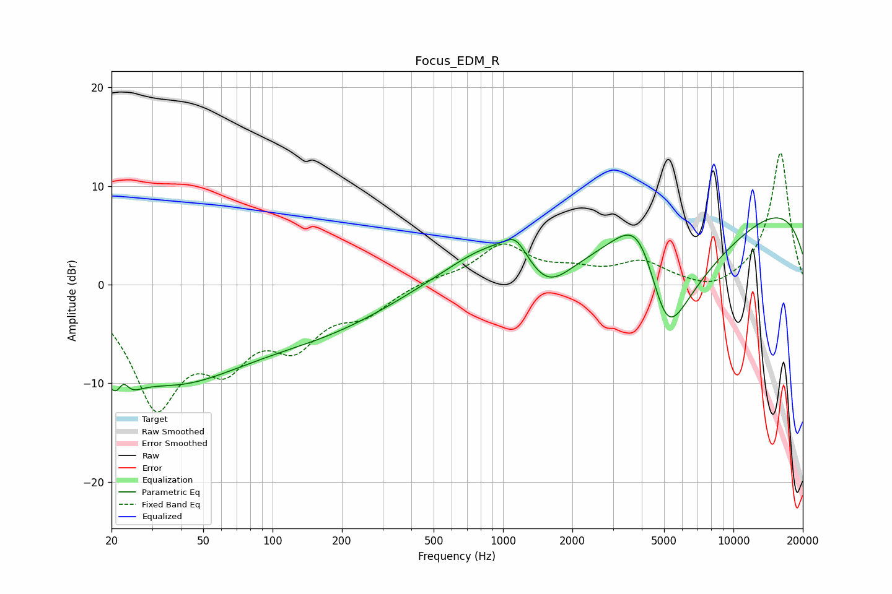

# Focus_EDM_R
See [usage instructions](https://github.com/jaakkopasanen/AutoEq#usage) for more options and info.

### Parametric EQs
Apply preamp of -6.9 dB when using parametric equalizer.

|   # | Type    |   Fc (Hz) |    Q |   Gain (dB) |
|-----|---------|-----------|------|-------------|
|   1 | Peaking |        22 | 2.47 |        -5.3 |
|   2 | Peaking |        22 | 5.4  |         2.7 |
|   3 | Peaking |        37 | 0.41 |        -9.1 |
|   4 | Peaking |       177 | 0.46 |        -3.3 |
|   5 | Peaking |       951 | 0.67 |         4.4 |
|   6 | Peaking |      1136 | 2.91 |         1.9 |
|   7 | Peaking |      1551 | 1.34 |        -4   |
|   8 | Peaking |      3945 | 1.05 |        11.1 |
|   9 | Peaking |      5105 | 0.79 |       -20   |
|  10 | Peaking |      9525 | 0.18 |        10   |

### Fixed Band EQs
When using fixed band (also called graphic) equalizer, apply preamp of **-13.4 dB** (if available) and set gains manually with these parameters.

|   # | Type    |   Fc (Hz) |    Q |   Gain (dB) |
|-----|---------|-----------|------|-------------|
|   1 | Peaking |        31 | 1.41 |       -11.5 |
|   2 | Peaking |        62 | 1.41 |        -6.1 |
|   3 | Peaking |       125 | 1.41 |        -5.1 |
|   4 | Peaking |       250 | 1.41 |        -2.5 |
|   5 | Peaking |       500 | 1.41 |         0.6 |
|   6 | Peaking |      1000 | 1.41 |         3.9 |
|   7 | Peaking |      2000 | 1.41 |         1.1 |
|   8 | Peaking |      4000 | 1.41 |         2.1 |
|   9 | Peaking |      8000 | 1.41 |        -0.9 |
|  10 | Peaking |     16000 | 1.41 |        13.5 |

### Graphs

