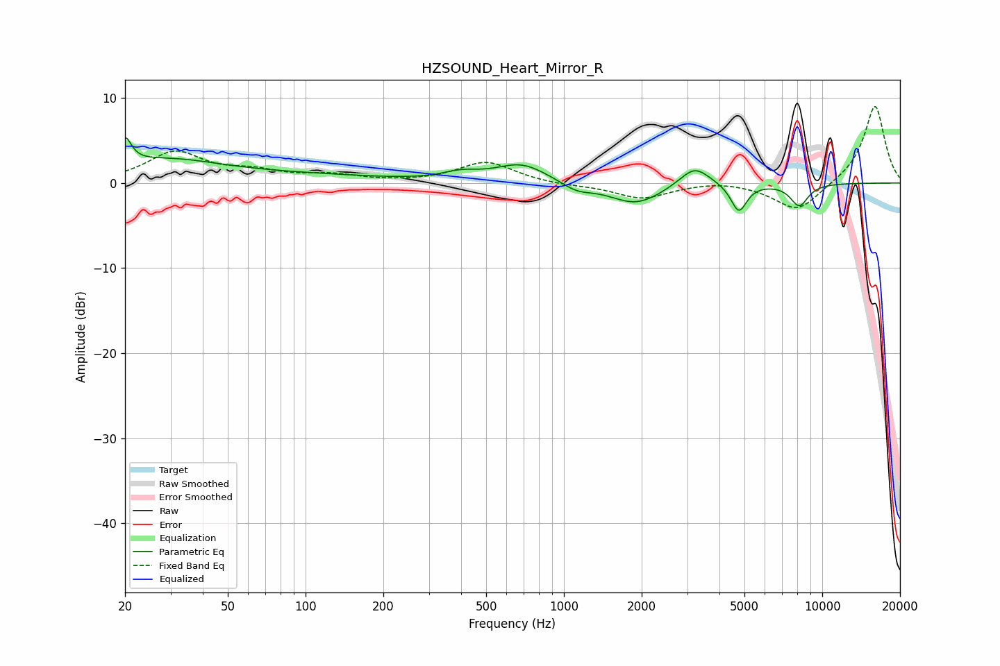

# HZSOUND_Heart_Mirror_R
See [usage instructions](https://github.com/jaakkopasanen/AutoEq#usage) for more options and info.

### Parametric EQs
Apply preamp of -5.4 dB when using parametric equalizer.

|   # | Type    |   Fc (Hz) |    Q |   Gain (dB) |
|-----|---------|-----------|------|-------------|
|   1 | Peaking |        20 | 5.95 |         3   |
|   2 | Peaking |        28 | 0.61 |         2.6 |
|   3 | Peaking |       105 | 0.49 |         0.7 |
|   4 | Peaking |       399 | 1.96 |         0.8 |
|   5 | Peaking |       686 | 1.4  |         2.2 |
|   6 | Peaking |      1121 | 2.38 |        -1   |
|   7 | Peaking |      1899 | 1.37 |        -2.5 |
|   8 | Peaking |      3206 | 2.43 |         2.4 |
|   9 | Peaking |      4754 | 4.57 |        -3.3 |
|  10 | Peaking |      8148 | 3.78 |        -2.6 |

### Fixed Band EQs
When using fixed band (also called graphic) equalizer, apply preamp of **-9.1 dB** (if available) and set gains manually with these parameters.

|   # | Type    |   Fc (Hz) |    Q |   Gain (dB) |
|-----|---------|-----------|------|-------------|
|   1 | Peaking |        31 | 1.41 |         3.5 |
|   2 | Peaking |        62 | 1.41 |         1.1 |
|   3 | Peaking |       125 | 1.41 |         0.8 |
|   4 | Peaking |       250 | 1.41 |         0   |
|   5 | Peaking |       500 | 1.41 |         2.5 |
|   6 | Peaking |      1000 | 1.41 |        -0.3 |
|   7 | Peaking |      2000 | 1.41 |        -1.8 |
|   8 | Peaking |      4000 | 1.41 |         0.4 |
|   9 | Peaking |      8000 | 1.41 |        -3.4 |
|  10 | Peaking |     16000 | 1.41 |         9.2 |

### Graphs

