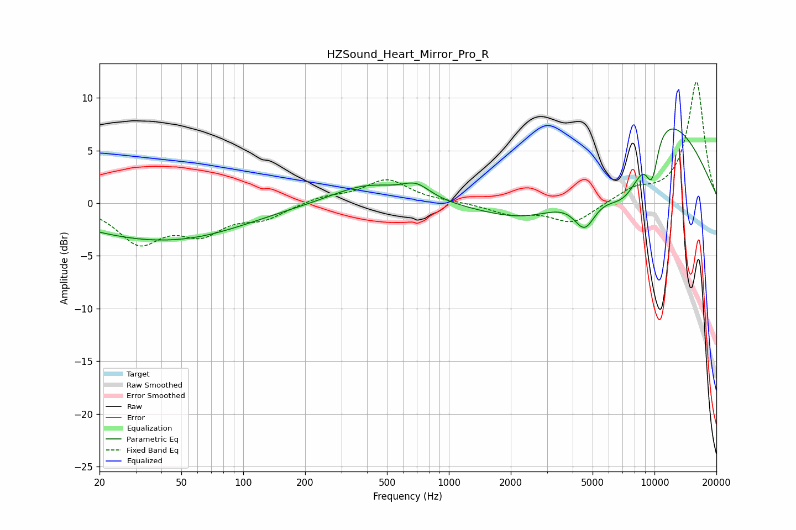

# HZSound_Heart_Mirror_Pro_R
See [usage instructions](https://github.com/jaakkopasanen/AutoEq#usage) for more options and info.

### Parametric EQs
Apply preamp of -7.1 dB when using parametric equalizer.

|   # | Type    |   Fc (Hz) |    Q |   Gain (dB) |
|-----|---------|-----------|------|-------------|
|   1 | Peaking |        30 | 0.41 |        -2.7 |
|   2 | Peaking |        69 | 0.5  |        -1.3 |
|   3 | Peaking |       398 | 0.84 |         1.8 |
|   4 | Peaking |       694 | 2.04 |         1.3 |
|   5 | Peaking |      2536 | 0.63 |        -2.7 |
|   6 | Peaking |      4575 | 2.57 |        -3.2 |
|   7 | Peaking |      7320 | 0.97 |        -8.1 |
|   8 | Peaking |      9564 | 4.77 |        -2.5 |
|   9 | Peaking |      9594 | 0.45 |        11.5 |
|  10 | Peaking |     10000 | 5.68 |        -1.4 |

### Fixed Band EQs
When using fixed band (also called graphic) equalizer, apply preamp of **-11.6 dB** (if available) and set gains manually with these parameters.

|   # | Type    |   Fc (Hz) |    Q |   Gain (dB) |
|-----|---------|-----------|------|-------------|
|   1 | Peaking |        31 | 1.41 |        -3.6 |
|   2 | Peaking |        62 | 1.41 |        -2.5 |
|   3 | Peaking |       125 | 1.41 |        -1.3 |
|   4 | Peaking |       250 | 1.41 |         0.6 |
|   5 | Peaking |       500 | 1.41 |         2.2 |
|   6 | Peaking |      1000 | 1.41 |         0.1 |
|   7 | Peaking |      2000 | 1.41 |        -1   |
|   8 | Peaking |      4000 | 1.41 |        -1.9 |
|   9 | Peaking |      8000 | 1.41 |         1.2 |
|  10 | Peaking |     16000 | 1.41 |        11.5 |

### Graphs

