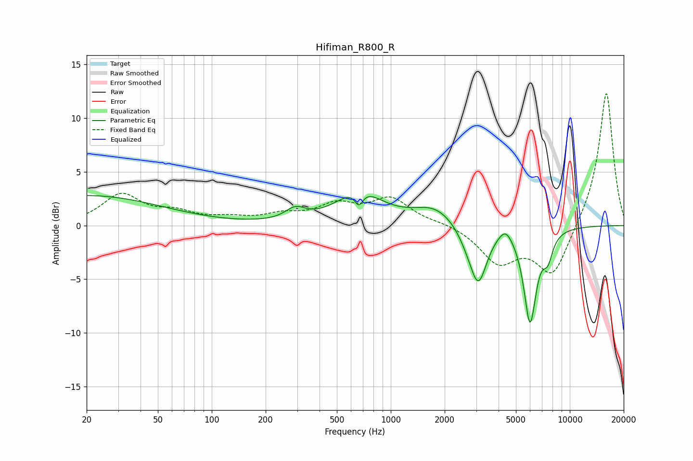

# Hifiman_R800_R
See [usage instructions](https://github.com/jaakkopasanen/AutoEq#usage) for more options and info.

### Parametric EQs
Apply preamp of -2.9 dB when using parametric equalizer.

|   # | Type    |   Fc (Hz) |    Q |   Gain (dB) |
|-----|---------|-----------|------|-------------|
|   1 | Peaking |        20 | 0.34 |         2.8 |
|   2 | Peaking |       293 | 2.56 |         1.1 |
|   3 | Peaking |       663 | 6    |        -1.4 |
|   4 | Peaking |       666 | 1.15 |         3   |
|   5 | Peaking |      1774 | 1.16 |         1.7 |
|   6 | Peaking |      2711 | 2.36 |        -1   |
|   7 | Peaking |      3088 | 2.97 |        -4.9 |
|   8 | Peaking |      4373 | 3.75 |         1.1 |
|   9 | Peaking |      5996 | 3.9  |        -8.8 |
|  10 | Peaking |      7531 | 4.86 |        -2   |

### Fixed Band EQs
When using fixed band (also called graphic) equalizer, apply preamp of **-12.4 dB** (if available) and set gains manually with these parameters.

|   # | Type    |   Fc (Hz) |    Q |   Gain (dB) |
|-----|---------|-----------|------|-------------|
|   1 | Peaking |        31 | 1.41 |         2.8 |
|   2 | Peaking |        62 | 1.41 |         1   |
|   3 | Peaking |       125 | 1.41 |         0.5 |
|   4 | Peaking |       250 | 1.41 |         0.8 |
|   5 | Peaking |       500 | 1.41 |         1.7 |
|   6 | Peaking |      1000 | 1.41 |         2.4 |
|   7 | Peaking |      2000 | 1.41 |         0.3 |
|   8 | Peaking |      4000 | 1.41 |        -3.3 |
|   9 | Peaking |      8000 | 1.41 |        -4.7 |
|  10 | Peaking |     16000 | 1.41 |        12.6 |

### Graphs

