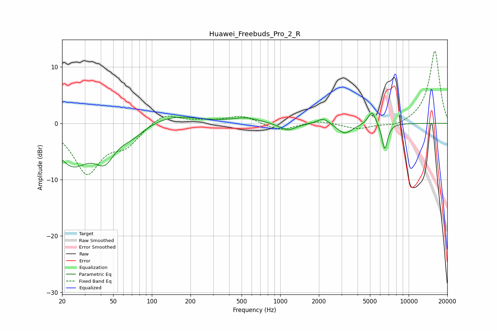

# Huawei_Freebuds_Pro_2_R
See [usage instructions](https://github.com/jaakkopasanen/AutoEq#usage) for more options and info.

### Parametric EQs
Apply preamp of -1.9 dB when using parametric equalizer.

|   # | Type    |   Fc (Hz) |    Q |   Gain (dB) |
|-----|---------|-----------|------|-------------|
|   1 | Peaking |        24 | 1.03 |        -6.9 |
|   2 | Peaking |        43 | 1.85 |        -4.5 |
|   3 | Peaking |        70 | 1.45 |        -1.7 |
|   4 | Peaking |       144 | 0.74 |         1.5 |
|   5 | Peaking |       541 | 1.38 |         0.9 |
|   6 | Peaking |      1140 | 2.21 |        -1.3 |
|   7 | Peaking |      2167 | 3.01 |         1.2 |
|   8 | Peaking |      3185 | 2.36 |        -1.9 |
|   9 | Peaking |      5187 | 4.59 |         2.5 |
|  10 | Peaking |      6519 | 6    |        -4.7 |

### Fixed Band EQs
When using fixed band (also called graphic) equalizer, apply preamp of **-12.9 dB** (if available) and set gains manually with these parameters.

|   # | Type    |   Fc (Hz) |    Q |   Gain (dB) |
|-----|---------|-----------|------|-------------|
|   1 | Peaking |        31 | 1.41 |        -8.6 |
|   2 | Peaking |        62 | 1.41 |        -3.3 |
|   3 | Peaking |       125 | 1.41 |         2   |
|   4 | Peaking |       250 | 1.41 |         0.4 |
|   5 | Peaking |       500 | 1.41 |         1.4 |
|   6 | Peaking |      1000 | 1.41 |        -1.4 |
|   7 | Peaking |      2000 | 1.41 |         0.6 |
|   8 | Peaking |      4000 | 1.41 |        -1   |
|   9 | Peaking |      8000 | 1.41 |        -0.7 |
|  10 | Peaking |     16000 | 1.41 |        12.9 |

### Graphs

