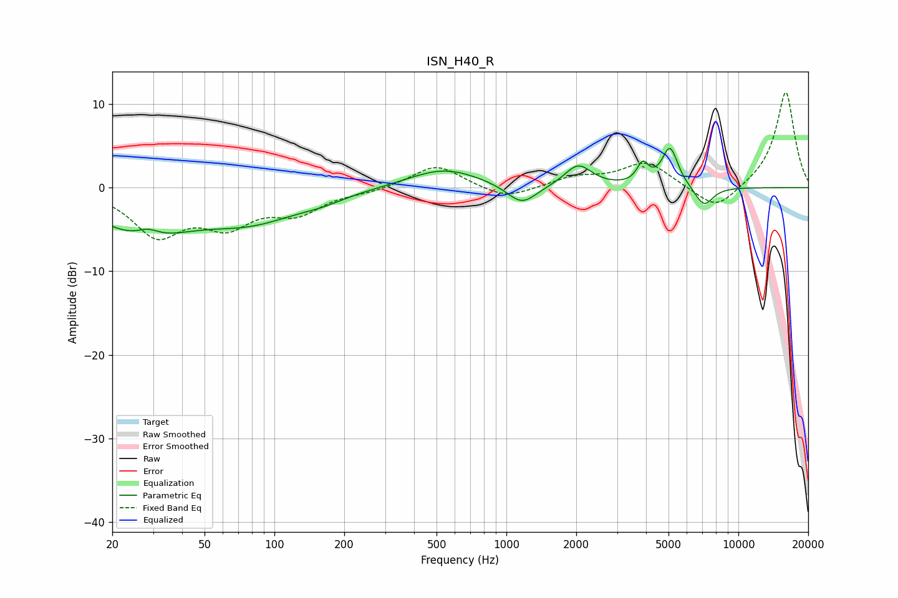

# ISN_H40_R
See [usage instructions](https://github.com/jaakkopasanen/AutoEq#usage) for more options and info.

### Parametric EQs
Apply preamp of -4.8 dB when using parametric equalizer.

|   # | Type    |   Fc (Hz) |    Q |   Gain (dB) |
|-----|---------|-----------|------|-------------|
|   1 | Peaking |        27 | 0.69 |        -5.2 |
|   2 | Peaking |        28 | 2.98 |         1   |
|   3 | Peaking |        81 | 0.67 |        -3.4 |
|   4 | Peaking |       161 | 1.49 |        -0.6 |
|   5 | Peaking |       538 | 0.92 |         2.3 |
|   6 | Peaking |      1167 | 2.19 |        -2.5 |
|   7 | Peaking |      2040 | 2.44 |         2.6 |
|   8 | Peaking |      3872 | 5.66 |         2.4 |
|   9 | Peaking |      5073 | 4.05 |         4.7 |
|  10 | Peaking |      7106 | 3.4  |        -2.4 |

### Fixed Band EQs
When using fixed band (also called graphic) equalizer, apply preamp of **-11.5 dB** (if available) and set gains manually with these parameters.

|   # | Type    |   Fc (Hz) |    Q |   Gain (dB) |
|-----|---------|-----------|------|-------------|
|   1 | Peaking |        31 | 1.41 |        -5.4 |
|   2 | Peaking |        62 | 1.41 |        -3.9 |
|   3 | Peaking |       125 | 1.41 |        -2.7 |
|   4 | Peaking |       250 | 1.41 |        -0.4 |
|   5 | Peaking |       500 | 1.41 |         2.8 |
|   6 | Peaking |      1000 | 1.41 |        -1.5 |
|   7 | Peaking |      2000 | 1.41 |         1.2 |
|   8 | Peaking |      4000 | 1.41 |         3   |
|   9 | Peaking |      8000 | 1.41 |        -2.9 |
|  10 | Peaking |     16000 | 1.41 |        11.6 |

### Graphs

