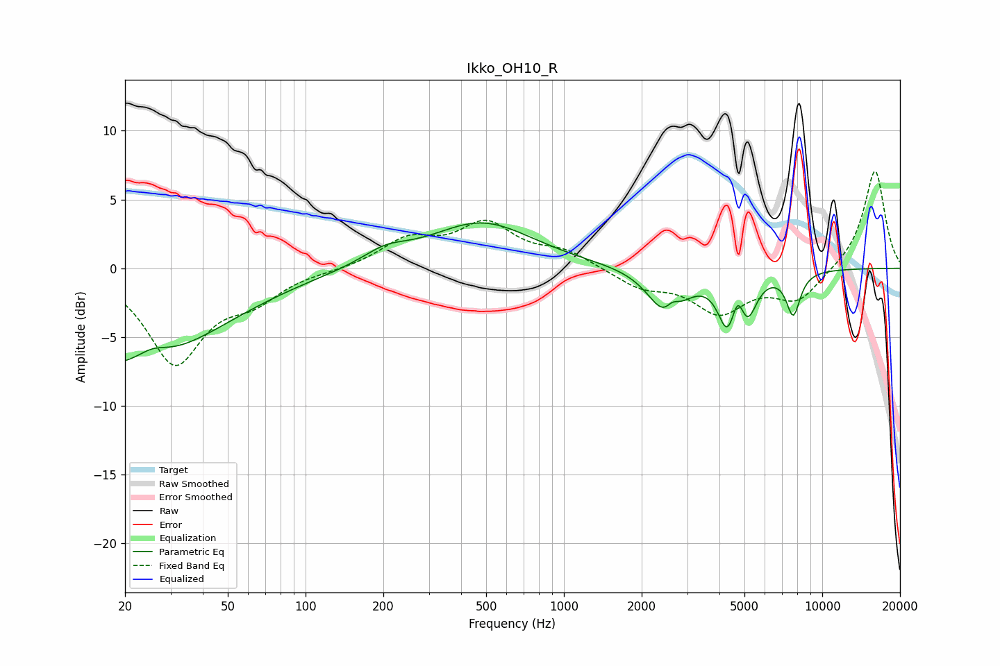

# Ikko_OH10_R
See [usage instructions](https://github.com/jaakkopasanen/AutoEq#usage) for more options and info.

### Parametric EQs
Apply preamp of -3.4 dB when using parametric equalizer.

|   # | Type    |   Fc (Hz) |    Q |   Gain (dB) |
|-----|---------|-----------|------|-------------|
|   1 | Peaking |        20 | 0.41 |        -7.2 |
|   2 | Peaking |        25 | 2.17 |         1   |
|   3 | Peaking |       203 | 1.57 |         1   |
|   4 | Peaking |       480 | 0.71 |         3.3 |
|   5 | Peaking |      2522 | 2.09 |        -3.7 |
|   6 | Peaking |      2628 | 5.01 |         1.1 |
|   7 | Peaking |      4308 | 3.8  |        -3.8 |
|   8 | Peaking |      4706 | 5.85 |         2   |
|   9 | Peaking |      5130 | 3.9  |        -2.8 |
|  10 | Peaking |      7723 | 4.91 |        -3.1 |

### Fixed Band EQs
When using fixed band (also called graphic) equalizer, apply preamp of **-7.1 dB** (if available) and set gains manually with these parameters.

|   # | Type    |   Fc (Hz) |    Q |   Gain (dB) |
|-----|---------|-----------|------|-------------|
|   1 | Peaking |        31 | 1.41 |        -6.7 |
|   2 | Peaking |        62 | 1.41 |        -1.9 |
|   3 | Peaking |       125 | 1.41 |        -0.1 |
|   4 | Peaking |       250 | 1.41 |         1.9 |
|   5 | Peaking |       500 | 1.41 |         3   |
|   6 | Peaking |      1000 | 1.41 |         1.1 |
|   7 | Peaking |      2000 | 1.41 |        -1.3 |
|   8 | Peaking |      4000 | 1.41 |        -3   |
|   9 | Peaking |      8000 | 1.41 |        -2.3 |
|  10 | Peaking |     16000 | 1.41 |         7.2 |

### Graphs

