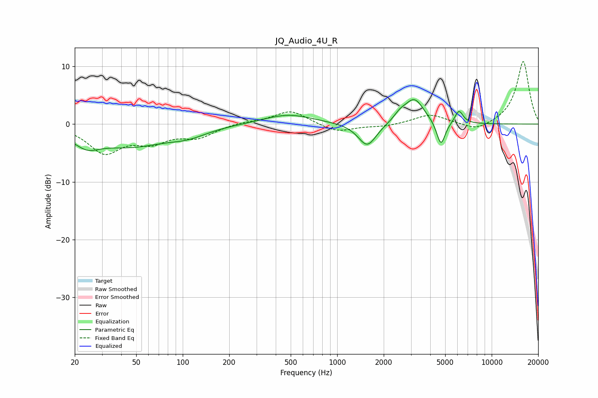

# JQ_Audio_4U_R
See [usage instructions](https://github.com/jaakkopasanen/AutoEq#usage) for more options and info.

### Parametric EQs
Apply preamp of -4.3 dB when using parametric equalizer.

|   # | Type    |   Fc (Hz) |    Q |   Gain (dB) |
|-----|---------|-----------|------|-------------|
|   1 | Peaking |        22 | 2.04 |         2.3 |
|   2 | Peaking |        23 | 1.73 |        -4.7 |
|   3 | Peaking |        46 | 0.6  |        -3.5 |
|   4 | Peaking |       108 | 1.13 |        -1.3 |
|   5 | Peaking |       480 | 0.89 |         1.7 |
|   6 | Peaking |      1565 | 2.38 |        -4.1 |
|   7 | Peaking |      2550 | 3.49 |         1.1 |
|   8 | Peaking |      3159 | 2.23 |         4.3 |
|   9 | Peaking |      4692 | 4.99 |        -4.3 |
|  10 | Peaking |      6138 | 5.13 |         2.3 |

### Fixed Band EQs
When using fixed band (also called graphic) equalizer, apply preamp of **-10.9 dB** (if available) and set gains manually with these parameters.

|   # | Type    |   Fc (Hz) |    Q |   Gain (dB) |
|-----|---------|-----------|------|-------------|
|   1 | Peaking |        31 | 1.41 |        -4.7 |
|   2 | Peaking |        62 | 1.41 |        -2.6 |
|   3 | Peaking |       125 | 1.41 |        -2.1 |
|   4 | Peaking |       250 | 1.41 |         0.4 |
|   5 | Peaking |       500 | 1.41 |         2.4 |
|   6 | Peaking |      1000 | 1.41 |        -1.4 |
|   7 | Peaking |      2000 | 1.41 |        -0.4 |
|   8 | Peaking |      4000 | 1.41 |         1.7 |
|   9 | Peaking |      8000 | 1.41 |        -1.3 |
|  10 | Peaking |     16000 | 1.41 |        11   |

### Graphs

