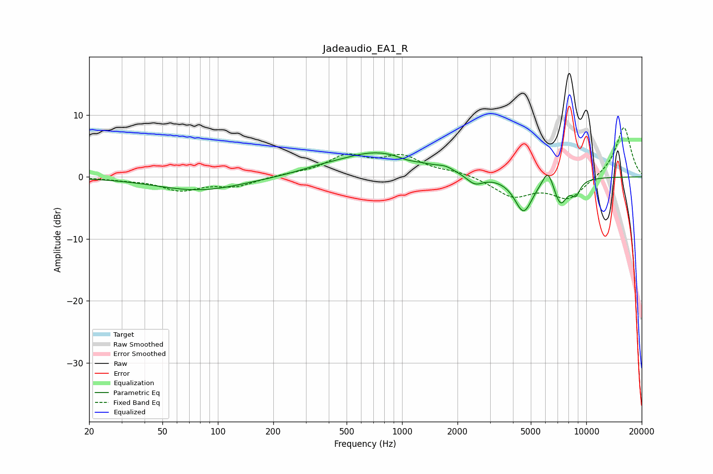

# Jadeaudio_EA1_R
See [usage instructions](https://github.com/jaakkopasanen/AutoEq#usage) for more options and info.

### Parametric EQs
Apply preamp of -4.0 dB when using parametric equalizer.

|   # | Type    |   Fc (Hz) |    Q |   Gain (dB) |
|-----|---------|-----------|------|-------------|
|   1 | Peaking |        80 | 0.6  |        -2.2 |
|   2 | Peaking |       349 | 1.25 |         0.4 |
|   3 | Peaking |       738 | 0.65 |         4   |
|   4 | Peaking |      1060 | 2.77 |        -0.4 |
|   5 | Peaking |      1714 | 3.22 |         0.6 |
|   6 | Peaking |      2484 | 3.08 |        -1.6 |
|   7 | Peaking |      4568 | 2.84 |        -5.6 |
|   8 | Peaking |      6197 | 4.52 |         3   |
|   9 | Peaking |      7237 | 3.6  |        -4.2 |
|  10 | Peaking |      8779 | 5.35 |        -2.1 |

### Fixed Band EQs
When using fixed band (also called graphic) equalizer, apply preamp of **-8.0 dB** (if available) and set gains manually with these parameters.

|   # | Type    |   Fc (Hz) |    Q |   Gain (dB) |
|-----|---------|-----------|------|-------------|
|   1 | Peaking |        31 | 1.41 |        -0.3 |
|   2 | Peaking |        62 | 1.41 |        -2   |
|   3 | Peaking |       125 | 1.41 |        -1.4 |
|   4 | Peaking |       250 | 1.41 |         0.3 |
|   5 | Peaking |       500 | 1.41 |         3.1 |
|   6 | Peaking |      1000 | 1.41 |         3   |
|   7 | Peaking |      2000 | 1.41 |         0.7 |
|   8 | Peaking |      4000 | 1.41 |        -3.1 |
|   9 | Peaking |      8000 | 1.41 |        -3.5 |
|  10 | Peaking |     16000 | 1.41 |         8.2 |

### Graphs

