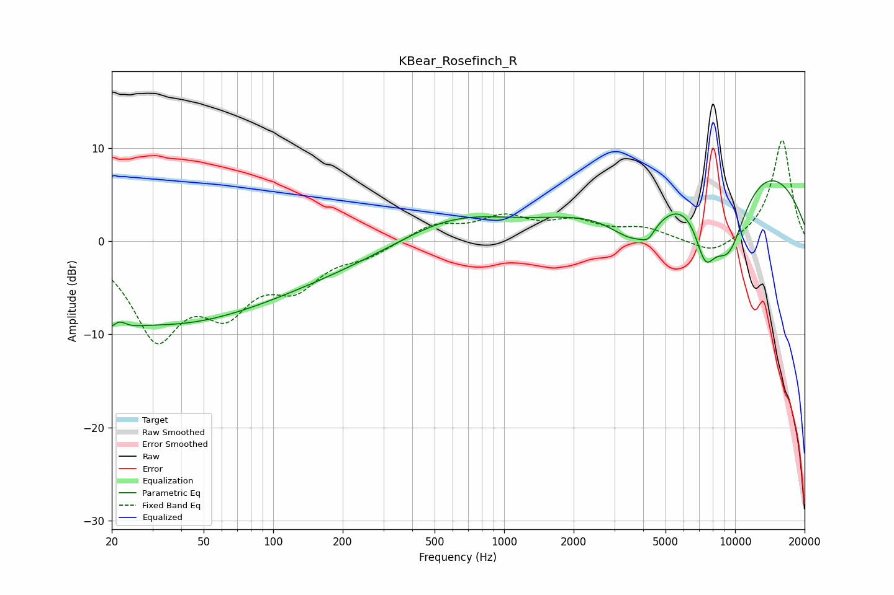

# KBear_Rosefinch_R
See [usage instructions](https://github.com/jaakkopasanen/AutoEq#usage) for more options and info.

### Parametric EQs
Apply preamp of -6.6 dB when using parametric equalizer.

|   # | Type    |   Fc (Hz) |    Q |   Gain (dB) |
|-----|---------|-----------|------|-------------|
|   1 | Peaking |        21 | 2.55 |        -5.1 |
|   2 | Peaking |        21 | 3.59 |         3.8 |
|   3 | Peaking |        31 | 0.33 |        -7.6 |
|   4 | Peaking |       281 | 0.18 |        -3.5 |
|   5 | Peaking |       611 | 0.5  |         5.1 |
|   6 | Peaking |      3754 | 1.11 |        -6.2 |
|   7 | Peaking |      4205 | 5.27 |        -1   |
|   8 | Peaking |      7422 | 2.85 |        -5.6 |
|   9 | Peaking |      8737 | 0.25 |        10.8 |
|  10 | Peaking |      9350 | 1.39 |        -9.8 |

### Fixed Band EQs
When using fixed band (also called graphic) equalizer, apply preamp of **-10.9 dB** (if available) and set gains manually with these parameters.

|   # | Type    |   Fc (Hz) |    Q |   Gain (dB) |
|-----|---------|-----------|------|-------------|
|   1 | Peaking |        31 | 1.41 |        -9.7 |
|   2 | Peaking |        62 | 1.41 |        -6.1 |
|   3 | Peaking |       125 | 1.41 |        -4.1 |
|   4 | Peaking |       250 | 1.41 |        -1.3 |
|   5 | Peaking |       500 | 1.41 |         1.8 |
|   6 | Peaking |      1000 | 1.41 |         2.3 |
|   7 | Peaking |      2000 | 1.41 |         1.8 |
|   8 | Peaking |      4000 | 1.41 |         1.2 |
|   9 | Peaking |      8000 | 1.41 |        -1.6 |
|  10 | Peaking |     16000 | 1.41 |        11   |

### Graphs

