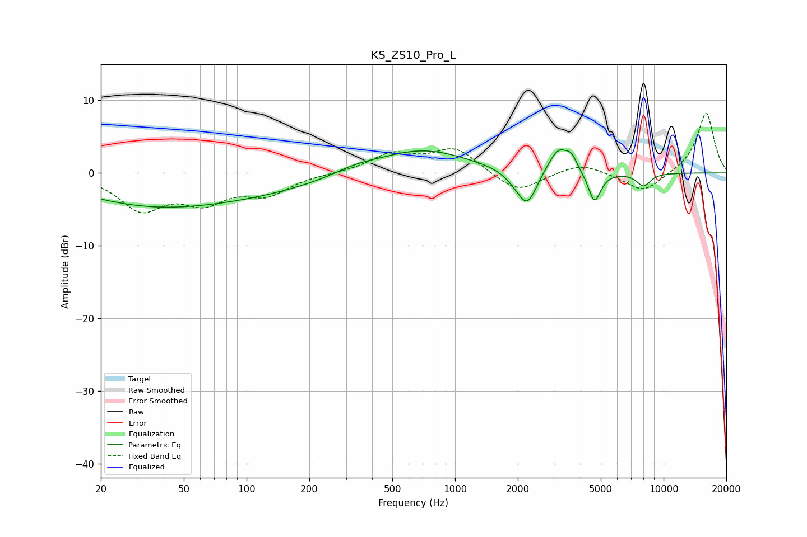

# KS_ZS10_Pro_L
See [usage instructions](https://github.com/jaakkopasanen/AutoEq#usage) for more options and info.

### Parametric EQs
Apply preamp of -3.3 dB when using parametric equalizer.

|   # | Type    |   Fc (Hz) |    Q |   Gain (dB) |
|-----|---------|-----------|------|-------------|
|   1 | Peaking |        33 | 0.41 |        -3.9 |
|   2 | Peaking |       118 | 0.43 |        -2   |
|   3 | Peaking |       333 | 1.34 |         0.8 |
|   4 | Peaking |       691 | 0.64 |         3.3 |
|   5 | Peaking |      1954 | 2.52 |        -1   |
|   6 | Peaking |      2225 | 3.1  |        -4.5 |
|   7 | Peaking |      3139 | 2.86 |         3.5 |
|   8 | Peaking |      3623 | 5.43 |         1.5 |
|   9 | Peaking |      4665 | 4.72 |        -4.3 |
|  10 | Peaking |      8019 | 3.98 |        -1.8 |

### Fixed Band EQs
When using fixed band (also called graphic) equalizer, apply preamp of **-8.3 dB** (if available) and set gains manually with these parameters.

|   # | Type    |   Fc (Hz) |    Q |   Gain (dB) |
|-----|---------|-----------|------|-------------|
|   1 | Peaking |        31 | 1.41 |        -4.8 |
|   2 | Peaking |        62 | 1.41 |        -3.4 |
|   3 | Peaking |       125 | 1.41 |        -2.7 |
|   4 | Peaking |       250 | 1.41 |        -0.1 |
|   5 | Peaking |       500 | 1.41 |         2.5 |
|   6 | Peaking |      1000 | 1.41 |         3.3 |
|   7 | Peaking |      2000 | 1.41 |        -2.8 |
|   8 | Peaking |      4000 | 1.41 |         1.5 |
|   9 | Peaking |      8000 | 1.41 |        -2.8 |
|  10 | Peaking |     16000 | 1.41 |         8.4 |

### Graphs

