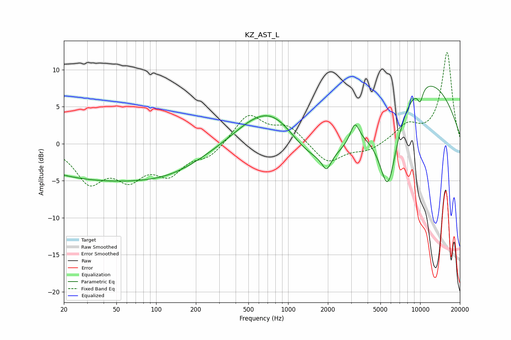

# KZ_AST_L
See [usage instructions](https://github.com/jaakkopasanen/AutoEq#usage) for more options and info.

### Parametric EQs
Apply preamp of -7.9 dB when using parametric equalizer.

|   # | Type    |   Fc (Hz) |    Q |   Gain (dB) |
|-----|---------|-----------|------|-------------|
|   1 | Peaking |        34 | 0.28 |        -4.5 |
|   2 | Peaking |       139 | 0.53 |        -2.1 |
|   3 | Peaking |       561 | 0.75 |         2.2 |
|   4 | Peaking |       827 | 0.74 |         5.2 |
|   5 | Peaking |      1553 | 0.51 |        -5.4 |
|   6 | Peaking |      1954 | 4.23 |        -2   |
|   7 | Peaking |      3203 | 4.09 |         2.8 |
|   8 | Peaking |      5702 | 1.81 |       -11.8 |
|   9 | Peaking |      9621 | 0.33 |         9.5 |
|  10 | Peaking |     10000 | 5.72 |        -1.8 |

### Fixed Band EQs
When using fixed band (also called graphic) equalizer, apply preamp of **-12.4 dB** (if available) and set gains manually with these parameters.

|   # | Type    |   Fc (Hz) |    Q |   Gain (dB) |
|-----|---------|-----------|------|-------------|
|   1 | Peaking |        31 | 1.41 |        -4.8 |
|   2 | Peaking |        62 | 1.41 |        -3.9 |
|   3 | Peaking |       125 | 1.41 |        -3.6 |
|   4 | Peaking |       250 | 1.41 |        -1.7 |
|   5 | Peaking |       500 | 1.41 |         3.9 |
|   6 | Peaking |      1000 | 1.41 |         2.2 |
|   7 | Peaking |      2000 | 1.41 |        -2.7 |
|   8 | Peaking |      4000 | 1.41 |        -1   |
|   9 | Peaking |      8000 | 1.41 |         2.3 |
|  10 | Peaking |     16000 | 1.41 |        12.3 |

### Graphs

