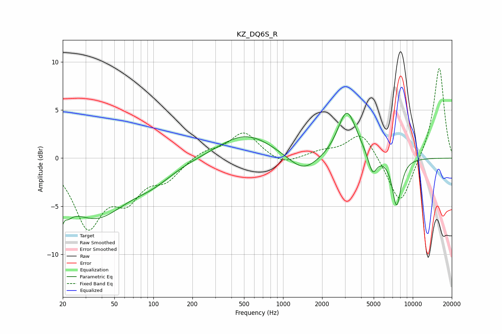

# KZ_DQ6S_R
See [usage instructions](https://github.com/jaakkopasanen/AutoEq#usage) for more options and info.

### Parametric EQs
Apply preamp of -4.8 dB when using parametric equalizer.

|   # | Type    |   Fc (Hz) |    Q |   Gain (dB) |
|-----|---------|-----------|------|-------------|
|   1 | Peaking |        20 | 3.84 |        -6   |
|   2 | Peaking |        20 | 5.79 |         3.2 |
|   3 | Peaking |        35 | 0.59 |        -5.8 |
|   4 | Peaking |        99 | 0.85 |        -1.5 |
|   5 | Peaking |       516 | 0.69 |         2.5 |
|   6 | Peaking |      1428 | 1.25 |        -1.8 |
|   7 | Peaking |      3076 | 2.06 |         4.4 |
|   8 | Peaking |      3453 | 1.8  |         0.8 |
|   9 | Peaking |      4899 | 4.2  |        -2.1 |
|  10 | Peaking |      7510 | 3.87 |        -5   |

### Fixed Band EQs
When using fixed band (also called graphic) equalizer, apply preamp of **-9.4 dB** (if available) and set gains manually with these parameters.

|   # | Type    |   Fc (Hz) |    Q |   Gain (dB) |
|-----|---------|-----------|------|-------------|
|   1 | Peaking |        31 | 1.41 |        -6.8 |
|   2 | Peaking |        62 | 1.41 |        -3.5 |
|   3 | Peaking |       125 | 1.41 |        -1.9 |
|   4 | Peaking |       250 | 1.41 |         0.8 |
|   5 | Peaking |       500 | 1.41 |         2.7 |
|   6 | Peaking |      1000 | 1.41 |        -0.8 |
|   7 | Peaking |      2000 | 1.41 |         0.6 |
|   8 | Peaking |      4000 | 1.41 |         2.8 |
|   9 | Peaking |      8000 | 1.41 |        -5.1 |
|  10 | Peaking |     16000 | 1.41 |         9.6 |

### Graphs

