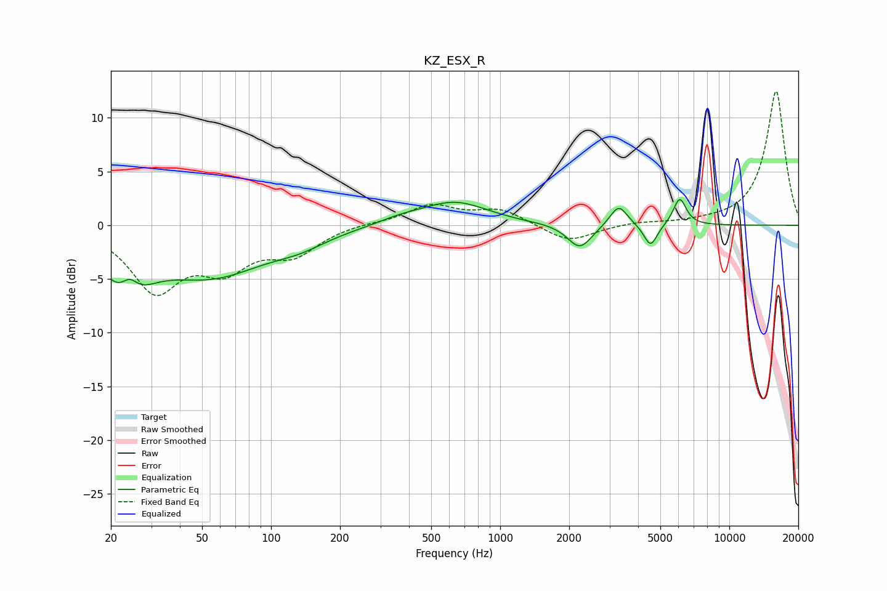

# KZ_ESX_R
See [usage instructions](https://github.com/jaakkopasanen/AutoEq#usage) for more options and info.

### Parametric EQs
Apply preamp of -2.5 dB when using parametric equalizer.

|   # | Type    |   Fc (Hz) |    Q |   Gain (dB) |
|-----|---------|-----------|------|-------------|
|   1 | Peaking |        23 | 1.52 |        -5.3 |
|   2 | Peaking |        24 | 3.62 |         2.2 |
|   3 | Peaking |        55 | 0.59 |        -4.4 |
|   4 | Peaking |       133 | 1.2  |        -0.9 |
|   5 | Peaking |       367 | 1.39 |         0.5 |
|   6 | Peaking |       633 | 0.98 |         2.2 |
|   7 | Peaking |      2225 | 2.69 |        -2.3 |
|   8 | Peaking |      3289 | 3.7  |         2   |
|   9 | Peaking |      4534 | 4.78 |        -2.1 |
|  10 | Peaking |      6075 | 4.93 |         2.6 |

### Fixed Band EQs
When using fixed band (also called graphic) equalizer, apply preamp of **-12.5 dB** (if available) and set gains manually with these parameters.

|   # | Type    |   Fc (Hz) |    Q |   Gain (dB) |
|-----|---------|-----------|------|-------------|
|   1 | Peaking |        31 | 1.41 |        -5.8 |
|   2 | Peaking |        62 | 1.41 |        -3.5 |
|   3 | Peaking |       125 | 1.41 |        -2.4 |
|   4 | Peaking |       250 | 1.41 |         0.2 |
|   5 | Peaking |       500 | 1.41 |         1.8 |
|   6 | Peaking |      1000 | 1.41 |         1.4 |
|   7 | Peaking |      2000 | 1.41 |        -1.6 |
|   8 | Peaking |      4000 | 1.41 |         0.3 |
|   9 | Peaking |      8000 | 1.41 |         0.2 |
|  10 | Peaking |     16000 | 1.41 |        12.5 |

### Graphs

