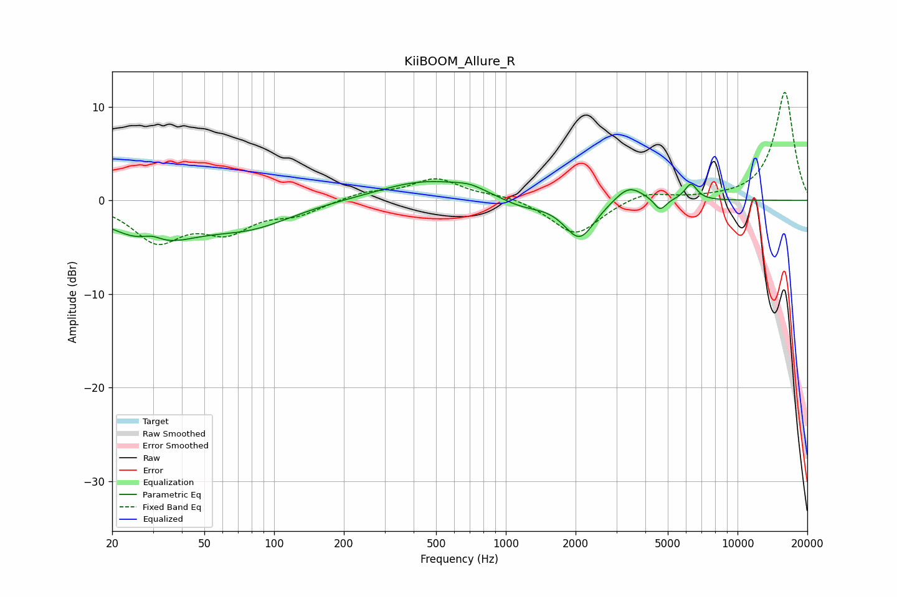

# KiiBOOM_Allure_R
See [usage instructions](https://github.com/jaakkopasanen/AutoEq#usage) for more options and info.

### Parametric EQs
Apply preamp of -2.1 dB when using parametric equalizer.

|   # | Type    |   Fc (Hz) |    Q |   Gain (dB) |
|-----|---------|-----------|------|-------------|
|   1 | Peaking |        30 | 3.08 |         0.9 |
|   2 | Peaking |        30 | 0.77 |        -4.2 |
|   3 | Peaking |        80 | 0.77 |        -2.3 |
|   4 | Peaking |       449 | 0.71 |         2.1 |
|   5 | Peaking |       700 | 2.08 |         0.6 |
|   6 | Peaking |      1174 | 1.55 |        -0.8 |
|   7 | Peaking |      2080 | 2.13 |        -4.2 |
|   8 | Peaking |      3396 | 2.27 |         1.9 |
|   9 | Peaking |      4634 | 5.37 |        -1.3 |
|  10 | Peaking |      6293 | 5.11 |         1.7 |

### Fixed Band EQs
When using fixed band (also called graphic) equalizer, apply preamp of **-11.6 dB** (if available) and set gains manually with these parameters.

|   # | Type    |   Fc (Hz) |    Q |   Gain (dB) |
|-----|---------|-----------|------|-------------|
|   1 | Peaking |        31 | 1.41 |        -4.1 |
|   2 | Peaking |        62 | 1.41 |        -2.9 |
|   3 | Peaking |       125 | 1.41 |        -1.3 |
|   4 | Peaking |       250 | 1.41 |         0.8 |
|   5 | Peaking |       500 | 1.41 |         2.2 |
|   6 | Peaking |      1000 | 1.41 |         0.5 |
|   7 | Peaking |      2000 | 1.41 |        -3.8 |
|   8 | Peaking |      4000 | 1.41 |         1   |
|   9 | Peaking |      8000 | 1.41 |         0.1 |
|  10 | Peaking |     16000 | 1.41 |        11.6 |

### Graphs

