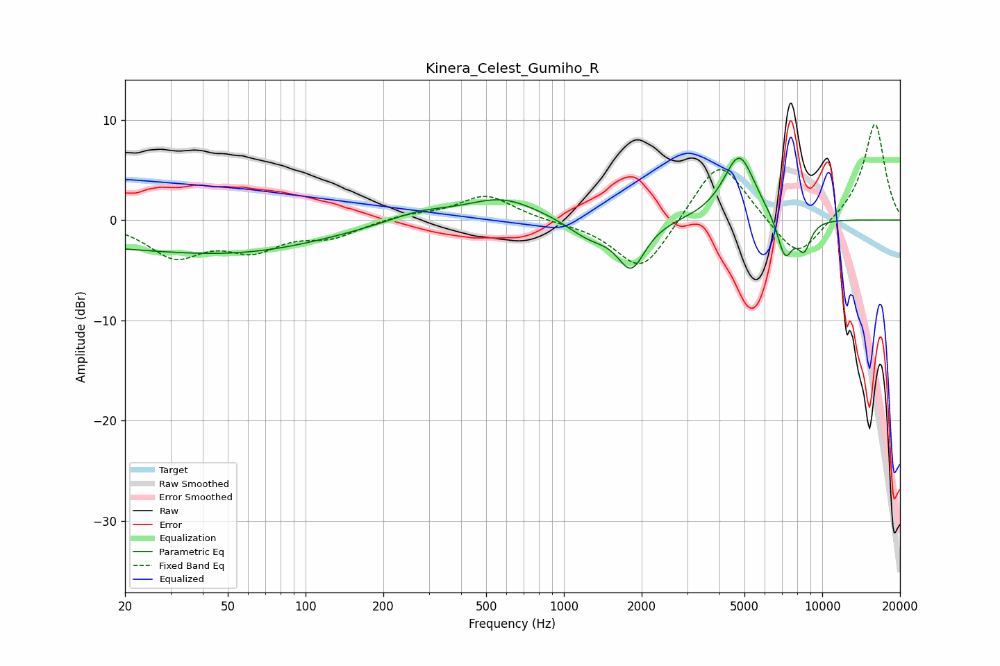

# Kinera_Celest_Gumiho_R
See [usage instructions](https://github.com/jaakkopasanen/AutoEq#usage) for more options and info.

### Parametric EQs
Apply preamp of -6.3 dB when using parametric equalizer.

|   # | Type    |   Fc (Hz) |    Q |   Gain (dB) |
|-----|---------|-----------|------|-------------|
|   1 | Peaking |        22 | 0.23 |        -2.4 |
|   2 | Peaking |        68 | 0.43 |        -1.4 |
|   3 | Peaking |       276 | 1.15 |         1   |
|   4 | Peaking |       578 | 1    |         2.2 |
|   5 | Peaking |      1254 | 1.66 |        -1.7 |
|   6 | Peaking |      1822 | 2.62 |        -4.6 |
|   7 | Peaking |      4761 | 2.22 |         6   |
|   8 | Peaking |      4859 | 2.69 |         0.6 |
|   9 | Peaking |      7174 | 4.35 |        -4.1 |
|  10 | Peaking |      8499 | 4.75 |        -2.8 |

### Fixed Band EQs
When using fixed band (also called graphic) equalizer, apply preamp of **-9.6 dB** (if available) and set gains manually with these parameters.

|   # | Type    |   Fc (Hz) |    Q |   Gain (dB) |
|-----|---------|-----------|------|-------------|
|   1 | Peaking |        31 | 1.41 |        -3.4 |
|   2 | Peaking |        62 | 1.41 |        -2.6 |
|   3 | Peaking |       125 | 1.41 |        -1.5 |
|   4 | Peaking |       250 | 1.41 |         0.5 |
|   5 | Peaking |       500 | 1.41 |         2.5 |
|   6 | Peaking |      1000 | 1.41 |        -0.2 |
|   7 | Peaking |      2000 | 1.41 |        -5.4 |
|   8 | Peaking |      4000 | 1.41 |         6.5 |
|   9 | Peaking |      8000 | 1.41 |        -4.2 |
|  10 | Peaking |     16000 | 1.41 |         9.8 |

### Graphs

