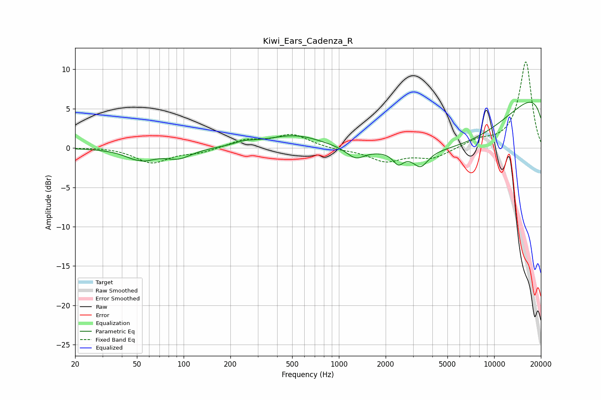

# Kiwi_Ears_Cadenza_R
See [usage instructions](https://github.com/jaakkopasanen/AutoEq#usage) for more options and info.

### Parametric EQs
Apply preamp of -5.9 dB when using parametric equalizer.

|   # | Type    |   Fc (Hz) |    Q |   Gain (dB) |
|-----|---------|-----------|------|-------------|
|   1 | Peaking |        51 | 4.88 |         0.1 |
|   2 | Peaking |        53 | 1.61 |        -1.5 |
|   3 | Peaking |        93 | 1.69 |        -1.2 |
|   4 | Peaking |       246 | 2.12 |         0.4 |
|   5 | Peaking |       521 | 0.77 |         1.7 |
|   6 | Peaking |      1283 | 2.42 |        -1.4 |
|   7 | Peaking |      2414 | 4.23 |        -1.5 |
|   8 | Peaking |      3357 | 2.93 |        -2   |
|   9 | Peaking |      6545 | 0.27 |       -11.6 |
|  10 | Peaking |     10000 | 0.18 |        13.2 |

### Fixed Band EQs
When using fixed band (also called graphic) equalizer, apply preamp of **-11.0 dB** (if available) and set gains manually with these parameters.

|   # | Type    |   Fc (Hz) |    Q |   Gain (dB) |
|-----|---------|-----------|------|-------------|
|   1 | Peaking |        31 | 1.41 |         0.1 |
|   2 | Peaking |        62 | 1.41 |        -1.9 |
|   3 | Peaking |       125 | 1.41 |        -0.6 |
|   4 | Peaking |       250 | 1.41 |         1   |
|   5 | Peaking |       500 | 1.41 |         1.7 |
|   6 | Peaking |      1000 | 1.41 |        -0.2 |
|   7 | Peaking |      2000 | 1.41 |        -1.6 |
|   8 | Peaking |      4000 | 1.41 |        -1.3 |
|   9 | Peaking |      8000 | 1.41 |         0.9 |
|  10 | Peaking |     16000 | 1.41 |        11   |

### Graphs

