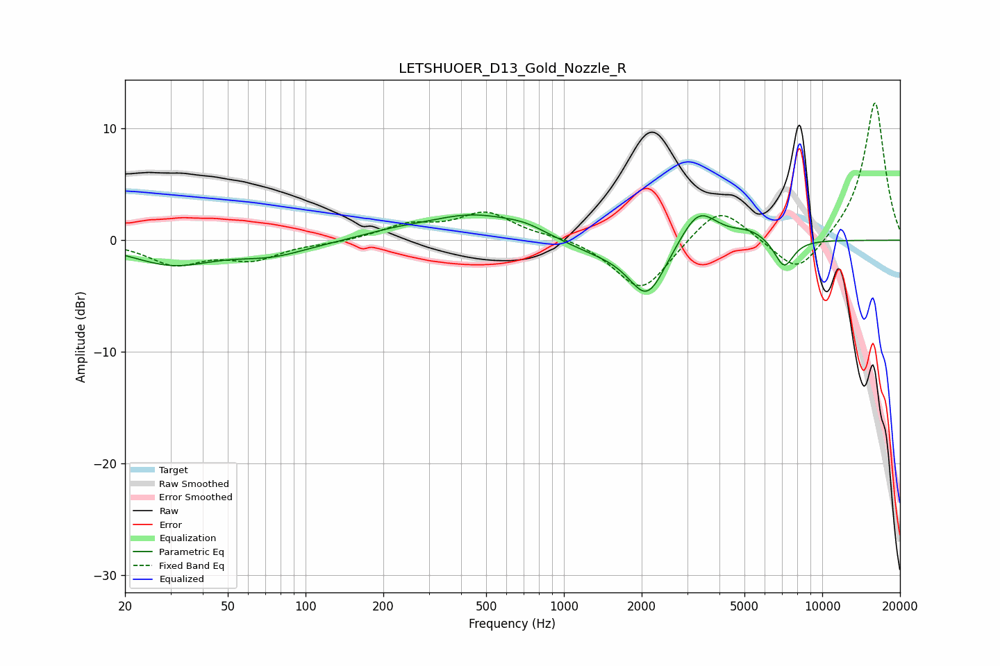

# LETSHUOER_D13_Gold_Nozzle_R
See [usage instructions](https://github.com/jaakkopasanen/AutoEq#usage) for more options and info.

### Parametric EQs
Apply preamp of -2.4 dB when using parametric equalizer.

|   # | Type    |   Fc (Hz) |    Q |   Gain (dB) |
|-----|---------|-----------|------|-------------|
|   1 | Peaking |        30 | 0.89 |        -2   |
|   2 | Peaking |        74 | 0.98 |        -1.2 |
|   3 | Peaking |       220 | 1.13 |         0.5 |
|   4 | Peaking |       444 | 0.78 |         2.2 |
|   5 | Peaking |       712 | 1.65 |         0.7 |
|   6 | Peaking |      1342 | 0.95 |        -1   |
|   7 | Peaking |      2104 | 1.95 |        -4.9 |
|   8 | Peaking |      3317 | 1.98 |         3.2 |
|   9 | Peaking |      5275 | 1.94 |         0.8 |
|  10 | Peaking |      7114 | 3.54 |        -2.6 |

### Fixed Band EQs
When using fixed band (also called graphic) equalizer, apply preamp of **-12.4 dB** (if available) and set gains manually with these parameters.

|   # | Type    |   Fc (Hz) |    Q |   Gain (dB) |
|-----|---------|-----------|------|-------------|
|   1 | Peaking |        31 | 1.41 |        -2   |
|   2 | Peaking |        62 | 1.41 |        -1.6 |
|   3 | Peaking |       125 | 1.41 |        -0.2 |
|   4 | Peaking |       250 | 1.41 |         1.3 |
|   5 | Peaking |       500 | 1.41 |         2.4 |
|   6 | Peaking |      1000 | 1.41 |         0.3 |
|   7 | Peaking |      2000 | 1.41 |        -4.7 |
|   8 | Peaking |      4000 | 1.41 |         3.3 |
|   9 | Peaking |      8000 | 1.41 |        -3.3 |
|  10 | Peaking |     16000 | 1.41 |        12.5 |

### Graphs

