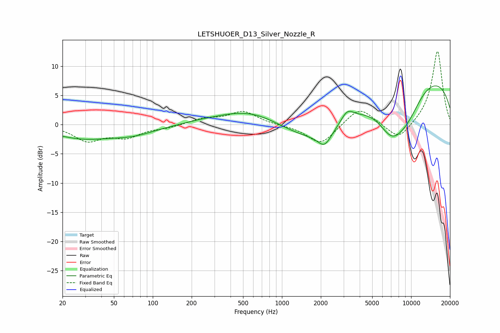

# LETSHUOER_D13_Silver_Nozzle_R
See [usage instructions](https://github.com/jaakkopasanen/AutoEq#usage) for more options and info.

### Parametric EQs
Apply preamp of -6.7 dB when using parametric equalizer.

|   # | Type    |   Fc (Hz) |    Q |   Gain (dB) |
|-----|---------|-----------|------|-------------|
|   1 | Peaking |        28 | 0.6  |        -2.2 |
|   2 | Peaking |        71 | 0.82 |        -1.3 |
|   3 | Peaking |       228 | 1.49 |         0.1 |
|   4 | Peaking |       594 | 0.54 |         3.1 |
|   5 | Peaking |      1930 | 0.47 |        -5.6 |
|   6 | Peaking |      2140 | 2.68 |        -2.5 |
|   7 | Peaking |      3204 | 2.9  |         2   |
|   8 | Peaking |      7065 | 1.19 |        -6.6 |
|   9 | Peaking |      9357 | 1.05 |        -4.5 |
|  10 | Peaking |     10000 | 0.2  |         9.2 |

### Fixed Band EQs
When using fixed band (also called graphic) equalizer, apply preamp of **-12.6 dB** (if available) and set gains manually with these parameters.

|   # | Type    |   Fc (Hz) |    Q |   Gain (dB) |
|-----|---------|-----------|------|-------------|
|   1 | Peaking |        31 | 1.41 |        -2.6 |
|   2 | Peaking |        62 | 1.41 |        -1.9 |
|   3 | Peaking |       125 | 1.41 |        -0.5 |
|   4 | Peaking |       250 | 1.41 |         1   |
|   5 | Peaking |       500 | 1.41 |         2.2 |
|   6 | Peaking |      1000 | 1.41 |        -0.1 |
|   7 | Peaking |      2000 | 1.41 |        -3.5 |
|   8 | Peaking |      4000 | 1.41 |         3.1 |
|   9 | Peaking |      8000 | 1.41 |        -2.9 |
|  10 | Peaking |     16000 | 1.41 |        12.7 |

### Graphs

