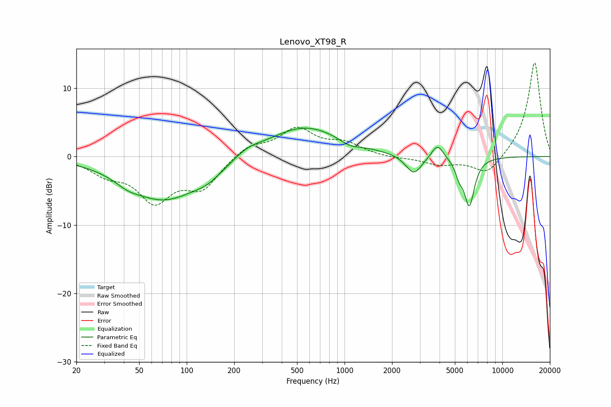

# Lenovo_XT98_R
See [usage instructions](https://github.com/jaakkopasanen/AutoEq#usage) for more options and info.

### Parametric EQs
Apply preamp of -4.2 dB when using parametric equalizer.

|   # | Type    |   Fc (Hz) |    Q |   Gain (dB) |
|-----|---------|-----------|------|-------------|
|   1 | Peaking |        42 | 1.98 |        -0.8 |
|   2 | Peaking |        71 | 0.62 |        -6.2 |
|   3 | Peaking |       136 | 1.46 |        -1.3 |
|   4 | Peaking |       243 | 1.79 |         0.9 |
|   5 | Peaking |       558 | 0.6  |         4.5 |
|   6 | Peaking |      1077 | 2.2  |        -0.8 |
|   7 | Peaking |      2748 | 2.78 |        -2.8 |
|   8 | Peaking |      3878 | 3.85 |         2.1 |
|   9 | Peaking |      5327 | 5.85 |        -1.7 |
|  10 | Peaking |      6173 | 4.23 |        -7   |

### Fixed Band EQs
When using fixed band (also called graphic) equalizer, apply preamp of **-13.8 dB** (if available) and set gains manually with these parameters.

|   # | Type    |   Fc (Hz) |    Q |   Gain (dB) |
|-----|---------|-----------|------|-------------|
|   1 | Peaking |        31 | 1.41 |        -2.1 |
|   2 | Peaking |        62 | 1.41 |        -6   |
|   3 | Peaking |       125 | 1.41 |        -4.2 |
|   4 | Peaking |       250 | 1.41 |         1.7 |
|   5 | Peaking |       500 | 1.41 |         3.9 |
|   6 | Peaking |      1000 | 1.41 |         1.7 |
|   7 | Peaking |      2000 | 1.41 |        -0.3 |
|   8 | Peaking |      4000 | 1.41 |        -1.1 |
|   9 | Peaking |      8000 | 1.41 |        -2.8 |
|  10 | Peaking |     16000 | 1.41 |        13.9 |

### Graphs

