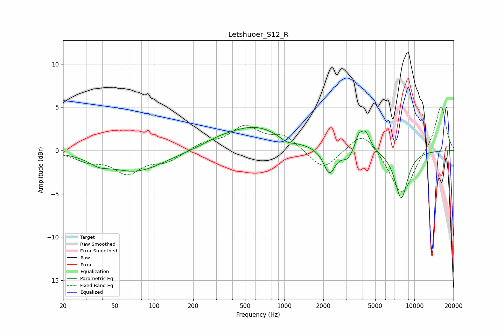

# Letshuoer_S12_R
See [usage instructions](https://github.com/jaakkopasanen/AutoEq#usage) for more options and info.

### Parametric EQs
Apply preamp of -2.8 dB when using parametric equalizer.

|   # | Type    |   Fc (Hz) |    Q |   Gain (dB) |
|-----|---------|-----------|------|-------------|
|   1 | Peaking |        38 | 1.93 |        -0.7 |
|   2 | Peaking |        73 | 0.66 |        -2.4 |
|   3 | Peaking |       313 | 1.17 |         0.5 |
|   4 | Peaking |       599 | 0.66 |         2.7 |
|   5 | Peaking |      1051 | 2.67 |        -0.6 |
|   6 | Peaking |      2227 | 3.25 |        -2.9 |
|   7 | Peaking |      3057 | 3.59 |        -1   |
|   8 | Peaking |      3724 | 6    |         1.3 |
|   9 | Peaking |      4193 | 3.68 |         2.3 |
|  10 | Peaking |      7922 | 2.67 |        -5.5 |

### Fixed Band EQs
When using fixed band (also called graphic) equalizer, apply preamp of **-5.1 dB** (if available) and set gains manually with these parameters.

|   # | Type    |   Fc (Hz) |    Q |   Gain (dB) |
|-----|---------|-----------|------|-------------|
|   1 | Peaking |        31 | 1.41 |        -1   |
|   2 | Peaking |        62 | 1.41 |        -2.5 |
|   3 | Peaking |       125 | 1.41 |        -1.2 |
|   4 | Peaking |       250 | 1.41 |         0.8 |
|   5 | Peaking |       500 | 1.41 |         2.6 |
|   6 | Peaking |      1000 | 1.41 |         1.6 |
|   7 | Peaking |      2000 | 1.41 |        -2.4 |
|   8 | Peaking |      4000 | 1.41 |         2.5 |
|   9 | Peaking |      8000 | 1.41 |        -5.3 |
|  10 | Peaking |     16000 | 1.41 |         5.3 |

### Graphs

