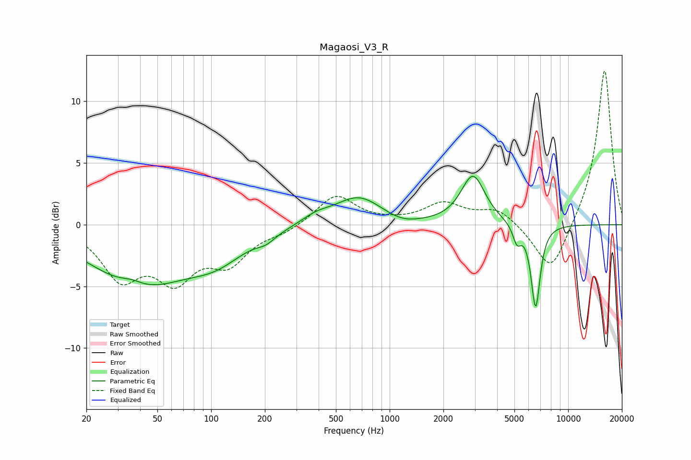

# Magaosi_V3_R
See [usage instructions](https://github.com/jaakkopasanen/AutoEq#usage) for more options and info.

### Parametric EQs
Apply preamp of -4.0 dB when using parametric equalizer.

|   # | Type    |   Fc (Hz) |    Q |   Gain (dB) |
|-----|---------|-----------|------|-------------|
|   1 | Peaking |        36 | 2.26 |         0.5 |
|   2 | Peaking |        40 | 0.51 |        -4.8 |
|   3 | Peaking |       108 | 0.9  |        -1.8 |
|   4 | Peaking |       203 | 2.75 |        -0.5 |
|   5 | Peaking |       386 | 1.74 |         0.6 |
|   6 | Peaking |       670 | 1.06 |         2.3 |
|   7 | Peaking |      1171 | 1.5  |        -0.5 |
|   8 | Peaking |      2930 | 2.12 |         4   |
|   9 | Peaking |      5166 | 6    |        -1.4 |
|  10 | Peaking |      6573 | 5.29 |        -6.8 |

### Fixed Band EQs
When using fixed band (also called graphic) equalizer, apply preamp of **-12.6 dB** (if available) and set gains manually with these parameters.

|   # | Type    |   Fc (Hz) |    Q |   Gain (dB) |
|-----|---------|-----------|------|-------------|
|   1 | Peaking |        31 | 1.41 |        -4   |
|   2 | Peaking |        62 | 1.41 |        -3.9 |
|   3 | Peaking |       125 | 1.41 |        -2.8 |
|   4 | Peaking |       250 | 1.41 |        -0.5 |
|   5 | Peaking |       500 | 1.41 |         2.4 |
|   6 | Peaking |      1000 | 1.41 |         0.1 |
|   7 | Peaking |      2000 | 1.41 |         1.6 |
|   8 | Peaking |      4000 | 1.41 |         1.3 |
|   9 | Peaking |      8000 | 1.41 |        -4.1 |
|  10 | Peaking |     16000 | 1.41 |        12.7 |

### Graphs

