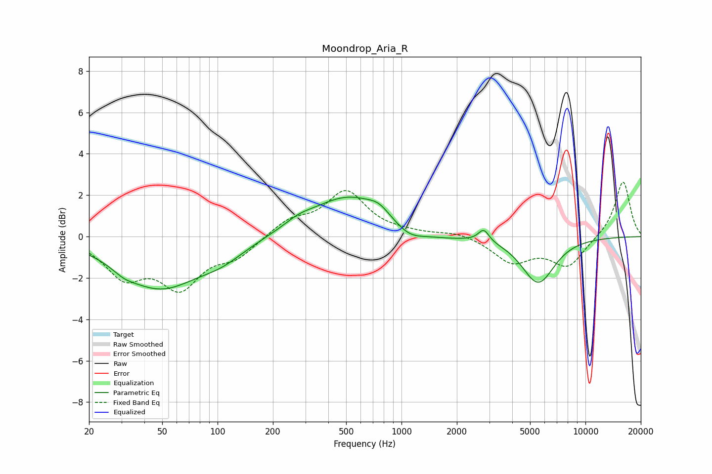

# Moondrop_Aria_R
See [usage instructions](https://github.com/jaakkopasanen/AutoEq#usage) for more options and info.

### Parametric EQs
Apply preamp of -2.0 dB when using parametric equalizer.

|   # | Type    |   Fc (Hz) |    Q |   Gain (dB) |
|-----|---------|-----------|------|-------------|
|   1 | Peaking |        31 | 2.25 |        -0.3 |
|   2 | Peaking |        49 | 0.68 |        -2.4 |
|   3 | Peaking |       105 | 1.09 |        -0.7 |
|   4 | Peaking |       275 | 1.75 |         0.3 |
|   5 | Peaking |       515 | 0.71 |         1.9 |
|   6 | Peaking |       754 | 2.5  |         0.4 |
|   7 | Peaking |      1101 | 1.71 |        -0.6 |
|   8 | Peaking |      1692 | 1.11 |        -0.2 |
|   9 | Peaking |      2800 | 4.92 |         0.6 |
|  10 | Peaking |      5533 | 1.56 |        -2.2 |

### Fixed Band EQs
When using fixed band (also called graphic) equalizer, apply preamp of **-2.7 dB** (if available) and set gains manually with these parameters.

|   # | Type    |   Fc (Hz) |    Q |   Gain (dB) |
|-----|---------|-----------|------|-------------|
|   1 | Peaking |        31 | 1.41 |        -1.8 |
|   2 | Peaking |        62 | 1.41 |        -2.2 |
|   3 | Peaking |       125 | 1.41 |        -0.9 |
|   4 | Peaking |       250 | 1.41 |         0.8 |
|   5 | Peaking |       500 | 1.41 |         2.1 |
|   6 | Peaking |      1000 | 1.41 |         0.1 |
|   7 | Peaking |      2000 | 1.41 |         0.2 |
|   8 | Peaking |      4000 | 1.41 |        -1.2 |
|   9 | Peaking |      8000 | 1.41 |        -1.4 |
|  10 | Peaking |     16000 | 1.41 |         2.7 |

### Graphs

