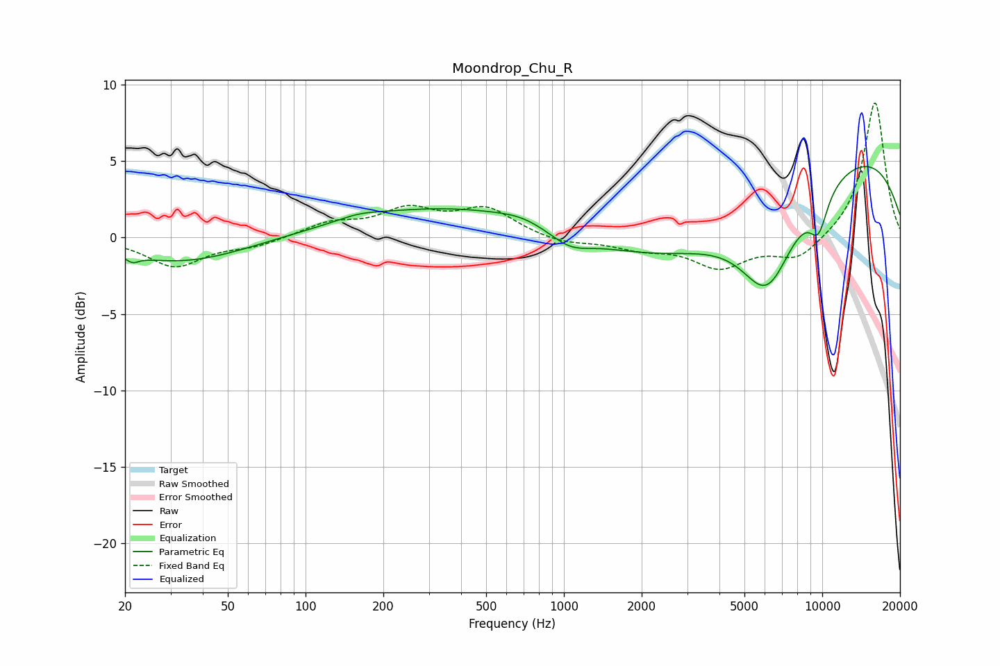

# Moondrop_Chu_R
See [usage instructions](https://github.com/jaakkopasanen/AutoEq#usage) for more options and info.

### Parametric EQs
Apply preamp of -4.7 dB when using parametric equalizer.

|   # | Type    |   Fc (Hz) |    Q |   Gain (dB) |
|-----|---------|-----------|------|-------------|
|   1 | Peaking |        21 | 5.85 |        -0.4 |
|   2 | Peaking |        33 | 0.57 |        -1.6 |
|   3 | Peaking |       162 | 1.78 |         0.3 |
|   4 | Peaking |       504 | 0.25 |         2.3 |
|   5 | Peaking |       684 | 1.62 |         0.3 |
|   6 | Peaking |      1052 | 1.79 |        -1   |
|   7 | Peaking |      4356 | 0.26 |        -5.1 |
|   8 | Peaking |      6130 | 1.36 |        -5.2 |
|   9 | Peaking |      9676 | 3.39 |        -2.4 |
|  10 | Peaking |     10000 | 0.26 |         7.9 |

### Fixed Band EQs
When using fixed band (also called graphic) equalizer, apply preamp of **-8.9 dB** (if available) and set gains manually with these parameters.

|   # | Type    |   Fc (Hz) |    Q |   Gain (dB) |
|-----|---------|-----------|------|-------------|
|   1 | Peaking |        31 | 1.41 |        -1.9 |
|   2 | Peaking |        62 | 1.41 |        -0.5 |
|   3 | Peaking |       125 | 1.41 |         0.9 |
|   4 | Peaking |       250 | 1.41 |         1.7 |
|   5 | Peaking |       500 | 1.41 |         1.8 |
|   6 | Peaking |      1000 | 1.41 |        -0.4 |
|   7 | Peaking |      2000 | 1.41 |        -0.6 |
|   8 | Peaking |      4000 | 1.41 |        -1.9 |
|   9 | Peaking |      8000 | 1.41 |        -1.5 |
|  10 | Peaking |     16000 | 1.41 |         9   |

### Graphs

