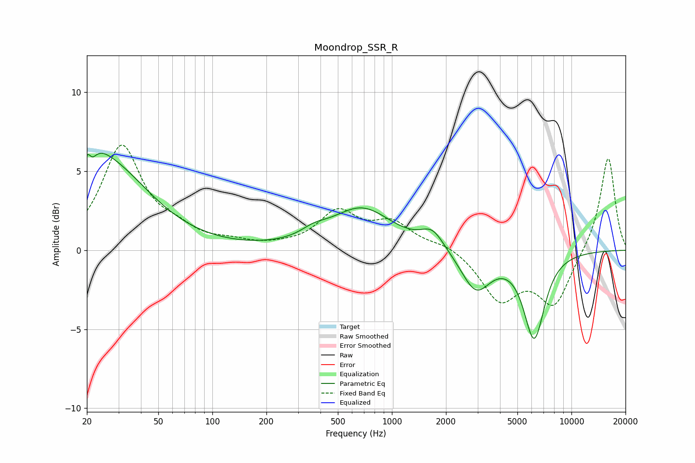

# Moondrop_SSR_R
See [usage instructions](https://github.com/jaakkopasanen/AutoEq#usage) for more options and info.

### Parametric EQs
Apply preamp of -6.2 dB when using parametric equalizer.

|   # | Type    |   Fc (Hz) |    Q |   Gain (dB) |
|-----|---------|-----------|------|-------------|
|   1 | Peaking |        21 | 5.94 |         3.2 |
|   2 | Peaking |        21 | 6    |        -3   |
|   3 | Peaking |        22 | 1.65 |         1.5 |
|   4 | Peaking |        27 | 0.62 |         4.8 |
|   5 | Peaking |       326 | 1.77 |        -0.2 |
|   6 | Peaking |       360 | 1.76 |         0.6 |
|   7 | Peaking |       681 | 0.85 |         2.6 |
|   8 | Peaking |      1681 | 2.23 |         1.2 |
|   9 | Peaking |      2934 | 1.73 |        -2.5 |
|  10 | Peaking |      6200 | 2.38 |        -5.4 |

### Fixed Band EQs
When using fixed band (also called graphic) equalizer, apply preamp of **-6.8 dB** (if available) and set gains manually with these parameters.

|   # | Type    |   Fc (Hz) |    Q |   Gain (dB) |
|-----|---------|-----------|------|-------------|
|   1 | Peaking |        31 | 1.41 |         6.5 |
|   2 | Peaking |        62 | 1.41 |         0.9 |
|   3 | Peaking |       125 | 1.41 |         0.4 |
|   4 | Peaking |       250 | 1.41 |         0.1 |
|   5 | Peaking |       500 | 1.41 |         2.3 |
|   6 | Peaking |      1000 | 1.41 |         1.6 |
|   7 | Peaking |      2000 | 1.41 |         0.4 |
|   8 | Peaking |      4000 | 1.41 |        -3   |
|   9 | Peaking |      8000 | 1.41 |        -3.4 |
|  10 | Peaking |     16000 | 1.41 |         6   |

### Graphs

