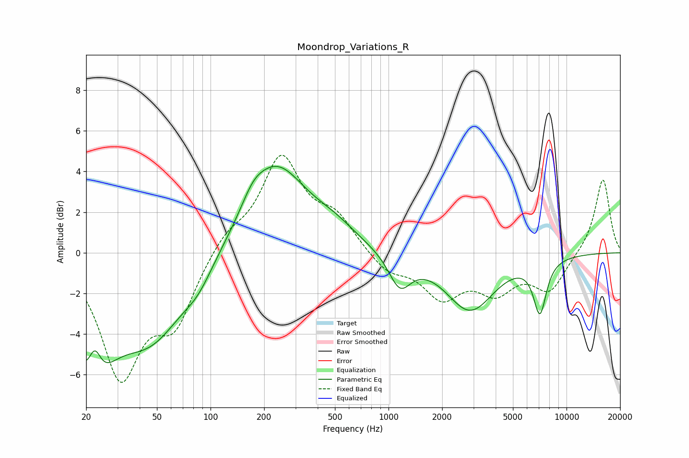

# Moondrop_Variations_R
See [usage instructions](https://github.com/jaakkopasanen/AutoEq#usage) for more options and info.

### Parametric EQs
Apply preamp of -4.3 dB when using parametric equalizer.

|   # | Type    |   Fc (Hz) |    Q |   Gain (dB) |
|-----|---------|-----------|------|-------------|
|   1 | Peaking |        21 | 1.22 |        -5.2 |
|   2 | Peaking |        22 | 3.94 |         1.8 |
|   3 | Peaking |        46 | 0.73 |        -3.8 |
|   4 | Peaking |        85 | 1.72 |        -0.8 |
|   5 | Peaking |       173 | 2.24 |         0.7 |
|   6 | Peaking |       231 | 0.83 |         4.2 |
|   7 | Peaking |       494 | 1.09 |         0.8 |
|   8 | Peaking |      1157 | 2.28 |        -1.6 |
|   9 | Peaking |      2872 | 1.05 |        -2.8 |
|  10 | Peaking |      7087 | 3.71 |        -2.6 |

### Fixed Band EQs
When using fixed band (also called graphic) equalizer, apply preamp of **-4.9 dB** (if available) and set gains manually with these parameters.

|   # | Type    |   Fc (Hz) |    Q |   Gain (dB) |
|-----|---------|-----------|------|-------------|
|   1 | Peaking |        31 | 1.41 |        -5.9 |
|   2 | Peaking |        62 | 1.41 |        -3.2 |
|   3 | Peaking |       125 | 1.41 |         0.9 |
|   4 | Peaking |       250 | 1.41 |         4.6 |
|   5 | Peaking |       500 | 1.41 |         1.6 |
|   6 | Peaking |      1000 | 1.41 |        -0.9 |
|   7 | Peaking |      2000 | 1.41 |        -2   |
|   8 | Peaking |      4000 | 1.41 |        -1.7 |
|   9 | Peaking |      8000 | 1.41 |        -1.8 |
|  10 | Peaking |     16000 | 1.41 |         3.7 |

### Graphs

