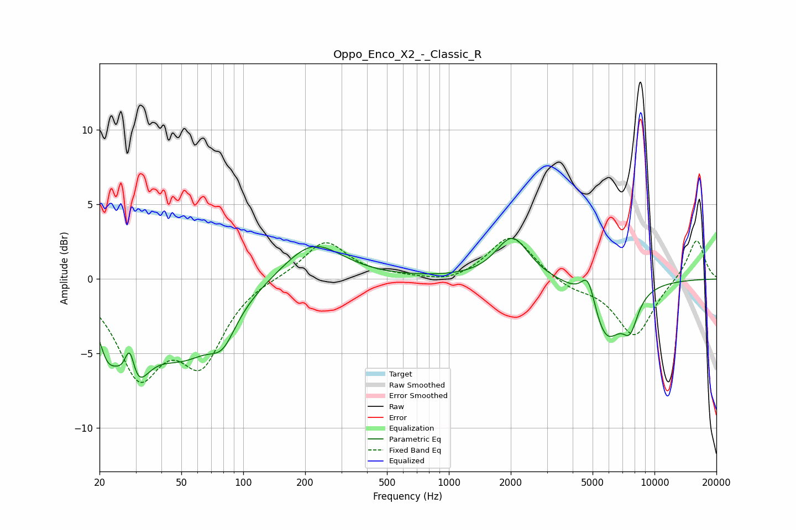

# Oppo_Enco_X2_-_Classic_R
See [usage instructions](https://github.com/jaakkopasanen/AutoEq#usage) for more options and info.

### Parametric EQs
Apply preamp of -2.8 dB when using parametric equalizer.

|   # | Type    |   Fc (Hz) |    Q |   Gain (dB) |
|-----|---------|-----------|------|-------------|
|   1 | Peaking |        22 | 3.55 |        -2.1 |
|   2 | Peaking |        28 | 5.23 |         3.6 |
|   3 | Peaking |        29 | 2.13 |        -6   |
|   4 | Peaking |        51 | 0.81 |        -4.5 |
|   5 | Peaking |        80 | 2.21 |        -2   |
|   6 | Peaking |       217 | 0.98 |         2.6 |
|   7 | Peaking |      2038 | 1.78 |         2.9 |
|   8 | Peaking |      4765 | 3.96 |         2.2 |
|   9 | Peaking |      5801 | 1.76 |        -4   |
|  10 | Peaking |      7611 | 3.48 |        -2.1 |

### Fixed Band EQs
When using fixed band (also called graphic) equalizer, apply preamp of **-2.8 dB** (if available) and set gains manually with these parameters.

|   # | Type    |   Fc (Hz) |    Q |   Gain (dB) |
|-----|---------|-----------|------|-------------|
|   1 | Peaking |        31 | 1.41 |        -6   |
|   2 | Peaking |        62 | 1.41 |        -5.1 |
|   3 | Peaking |       125 | 1.41 |         0.1 |
|   4 | Peaking |       250 | 1.41 |         2.6 |
|   5 | Peaking |       500 | 1.41 |         0.1 |
|   6 | Peaking |      1000 | 1.41 |        -0.4 |
|   7 | Peaking |      2000 | 1.41 |         3   |
|   8 | Peaking |      4000 | 1.41 |        -0.6 |
|   9 | Peaking |      8000 | 1.41 |        -3.9 |
|  10 | Peaking |     16000 | 1.41 |         2.8 |

### Graphs

