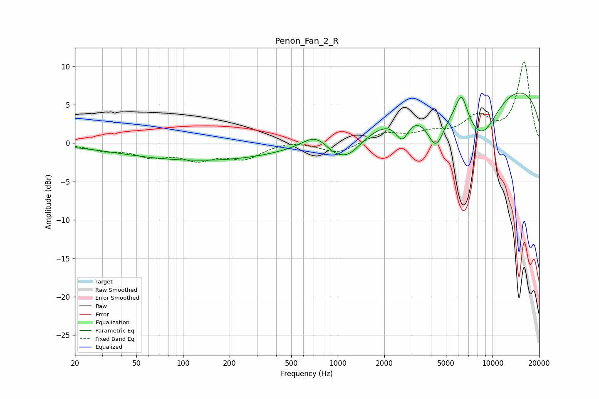

# Penon_Fan_2_R
See [usage instructions](https://github.com/jaakkopasanen/AutoEq#usage) for more options and info.

### Parametric EQs
Apply preamp of -6.6 dB when using parametric equalizer.

|   # | Type    |   Fc (Hz) |    Q |   Gain (dB) |
|-----|---------|-----------|------|-------------|
|   1 | Peaking |        70 | 0.5  |         0   |
|   2 | Peaking |       131 | 0.27 |        -2.3 |
|   3 | Peaking |       726 | 1.59 |         2   |
|   4 | Peaking |      1063 | 3.79 |         0.3 |
|   5 | Peaking |      1083 | 1.34 |        -3.8 |
|   6 | Peaking |      2609 | 3.27 |        -3   |
|   7 | Peaking |      4308 | 2.33 |        -5.4 |
|   8 | Peaking |      6304 | 3.79 |         3.3 |
|   9 | Peaking |      8449 | 1.08 |        -6.8 |
|  10 | Peaking |      9771 | 0.18 |         8.4 |

### Fixed Band EQs
When using fixed band (also called graphic) equalizer, apply preamp of **-10.7 dB** (if available) and set gains manually with these parameters.

|   # | Type    |   Fc (Hz) |    Q |   Gain (dB) |
|-----|---------|-----------|------|-------------|
|   1 | Peaking |        31 | 1.41 |        -0.8 |
|   2 | Peaking |        62 | 1.41 |        -1.5 |
|   3 | Peaking |       125 | 1.41 |        -1.8 |
|   4 | Peaking |       250 | 1.41 |        -1.8 |
|   5 | Peaking |       500 | 1.41 |         0.4 |
|   6 | Peaking |      1000 | 1.41 |        -1.4 |
|   7 | Peaking |      2000 | 1.41 |         1.3 |
|   8 | Peaking |      4000 | 1.41 |         1.1 |
|   9 | Peaking |      8000 | 1.41 |         3.1 |
|  10 | Peaking |     16000 | 1.41 |        10.5 |

### Graphs

