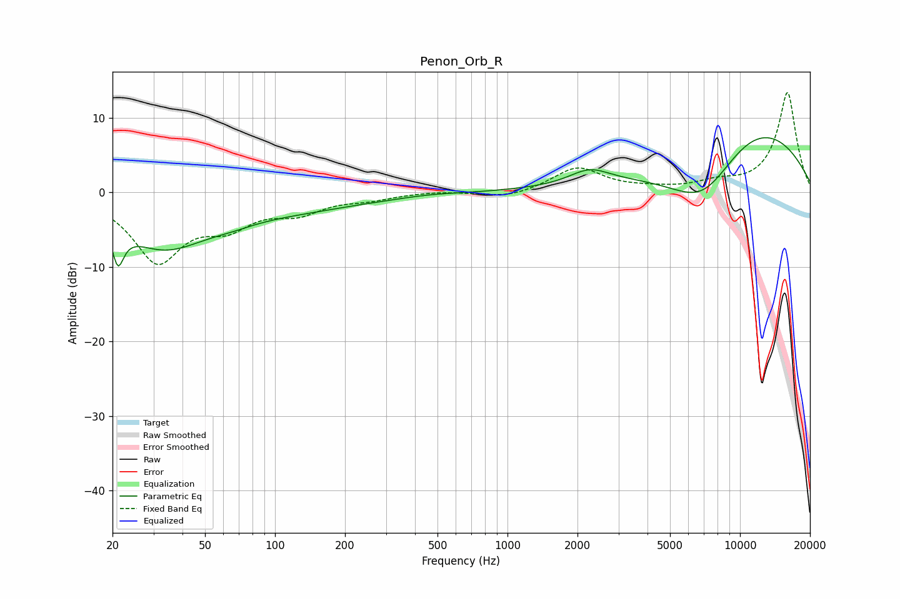

# Penon_Orb_R
See [usage instructions](https://github.com/jaakkopasanen/AutoEq#usage) for more options and info.

### Parametric EQs
Apply preamp of -7.4 dB when using parametric equalizer.

|   # | Type    |   Fc (Hz) |    Q |   Gain (dB) |
|-----|---------|-----------|------|-------------|
|   1 | Peaking |        21 | 4.74 |         3   |
|   2 | Peaking |        21 | 5.32 |        -7.9 |
|   3 | Peaking |        33 | 0.73 |        -6.8 |
|   4 | Peaking |        66 | 1.4  |        -0.6 |
|   5 | Peaking |       120 | 0.46 |        -2   |
|   6 | Peaking |       274 | 3.22 |        -0   |
|   7 | Peaking |       479 | 1.33 |         0.2 |
|   8 | Peaking |      2253 | 1.63 |         2   |
|   9 | Peaking |      6948 | 0.73 |       -10   |
|  10 | Peaking |     10000 | 0.37 |        12   |

### Fixed Band EQs
When using fixed band (also called graphic) equalizer, apply preamp of **-13.5 dB** (if available) and set gains manually with these parameters.

|   # | Type    |   Fc (Hz) |    Q |   Gain (dB) |
|-----|---------|-----------|------|-------------|
|   1 | Peaking |        31 | 1.41 |        -8.9 |
|   2 | Peaking |        62 | 1.41 |        -3.6 |
|   3 | Peaking |       125 | 1.41 |        -2.3 |
|   4 | Peaking |       250 | 1.41 |        -0.7 |
|   5 | Peaking |       500 | 1.41 |         0.2 |
|   6 | Peaking |      1000 | 1.41 |        -0.8 |
|   7 | Peaking |      2000 | 1.41 |         3.3 |
|   8 | Peaking |      4000 | 1.41 |         0.3 |
|   9 | Peaking |      8000 | 1.41 |         1.1 |
|  10 | Peaking |     16000 | 1.41 |        13.4 |

### Graphs

